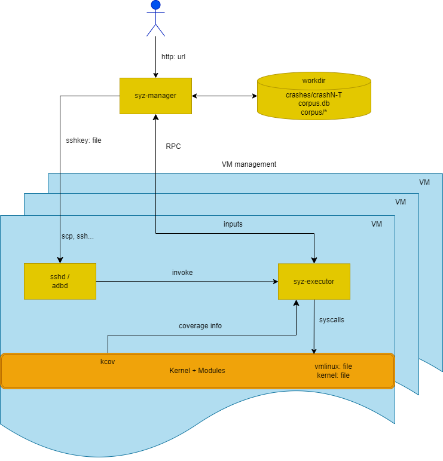
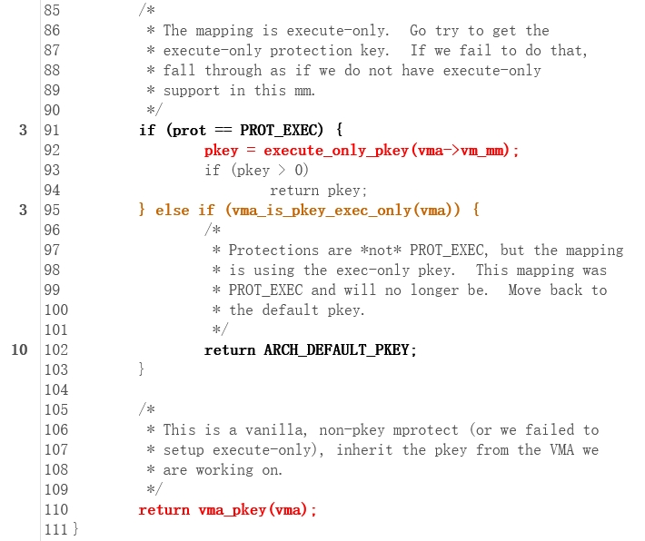

<h1 style="display: flex; justify-content: center; align-items: center; font-size: 30px; font-weight: bold; color: #fff; margin-bottom: 20px;">Syzkaller 介绍</h1>

[TOC]

syzkaller 是一个基于覆盖引导（coverage-guided），能够对内核进行 fuzz 的白盒测试工具。syzkaller 本身支持多种系统调用，但是针对驱动进行 fuzz，主要关注 open、read、write、ioctl、mmap。它支持Akaros, FreeBSD, Fuchsia, gVisor, Linux, NetBSD, OpenBSD, Windows，Darwin等操作系统内核

> 覆盖引导：通过向目标程序插桩，记录程序执行路径和中间执行状态等，将这些信息反馈给fuzzer，然后通过不断修改输入，使得程序执行更多的路径，从而发现潜在的问题


# 运行SyzKaller所需条件

- 内核源码 -> cc编译 -> 内核镜像
- syzkaller源码 -> go编译 -> syzkaller可执行文件（syz-manager等）
- qemu虚拟机
- 系统调用描述文件（syscall description）
- 配置文件（config file）

# SyzKaller Architecture and Workflow



SyzKaller的工作流程如上图所示。

`syz-manager`：运行在host上 

- 负责调度fuzz任务，包括启动fuzz任务，监控fuzz任务，收集fuzz结果

- 负责fuzz过程：包括输入生成，变异，最小化等

- 持久化存储corpus和crash

`syz-executor`：运行在guest上 

`syz-manager` 会开启 `syz-executor` 进程（每一个VM中开启一个`syz-executor`），它会使用PRC（远过程调用）于`syz-manager`通信，接收来自`syz-manager`的指令，执行fuzz任务，并将结果返回给`syz-manager`。

为了执行程序，`syz-executor`会启动临时子进程。每个临时子进程执行一个输入（一系列系统调用）。它被设计得尽可能简单（为了不干扰模糊测试过程），用c++编写，编译为静态二进制文件，使用共享内存进行通信。

# Syscall Descriptions

`syz-manager` 基于系统调用描述文件（syscall descriptions）生成输入，输入就是一个系统调用序列。系统调用描述文件定义了系统调用的参数类型，参数个数，参数值范围等。

一个系统调用序列长下面这种样子：
```c
open(file filename, flags flags[open_flags], mode flags[open_mode]) fd
read(fd fd, buf buffer[out], count len[buf])
close(fd fd)
open_mode = S_IRUSR, S_IWUSR, S_IXUSR, S_IRGRP, S_IWGRP, S_IXGRP, S_IROTH, S_IWOTH, S_IXOTH
```

描述文件被放到`sys/$OS/*.txt`文件中，vscode提供了`syz-langextension`插件，能够实现语法高亮，可以方便的查看syscall描述。`syzkaller`会读取并转化这些描述，然后将它们用于种子的生成，变异，执行，最小化，序列化和反序列化一个程序。一个程序就是一系列的操作系统调用，每一个调用的每一个参数都有具体的值。以下就是一个程序的示例：

```
r0 = open(&(0x7f0000000000)="./file0", 0x3, 0x9)
read(r0, &(0x7f0000000000), 42)
close(r0)
```

在`syzkaller`实际修改程序的时候，它使用的是内存中的类似AST的表达方式，这中表达方式由Call和Arg组成，它们在[prog/prog.go](/fuzzer/syzkaller/src/prog/prog.go)中定义。Call表示一个系统调用，Arg表示一个参数。Call和Arg都有一些字段，它们用于表示参数类型，参数值，参数值范围等。被用于[analyze](/fuzzer/syzkaller/src/prog/analysis.go), [generate](/fuzzer/syzkaller/src/prog/rand.go), [mutate](/fuzzer/syzkaller/src/prog/mutation.go),
[minimize](/fuzzer/syzkaller/src/prog/minimization.go), [validate](/fuzzer/syzkaller/syzkaller/prog/validation.go)等。

这种存储在内存中的结构可以使用代码[transformed](/fuzzer/syzkaller/src/prog/encoding.go)转化成为人类可以阅读的格式，也可以反过来。

除了以上两种格式之外，还有另一个[binary representation](/fuzzer/syzkaller/src/prog/decodeexec.go)， 这是一种更加轻便简洁的格式，它不包含太多的信息，但是它足够用于执行程序，被用于[syz-executor](/fuzzer/syzkaller/src/executor/executor.cc)的实际执行。

目前所有的syzcall描述都是手动编写的，虽然有一些工具如SyzDescribe等，可以自动生成一些描述，但是这些工具能力有限，生成的描述并不完整，也不一定准确。因此，现在的syscall描述主要还是依靠手动编写。

# Coverage

## overview

Syzkaller是一个coverage-guided的fuzzer。具体来说他用了LLVM的[Sanitizer Coverage (tracing mode)](https://clang.llvm.org/docs/SanitizerCoverage.html#tracing-pcs)和[KCOV](https://www.kernel.org/doc/html/latest/dev-tools/kcov.html)来收集覆盖情况。值得注意的是，现在`gcc`也是可以用`Sanitizer Coverage`的。

编译期间，编译器会向每一个[Basic Block](https://en.wikipedia.org/wiki/Basic_block)或[CFG edge](https://en.wikipedia.org/wiki/Control-flow_graph)中插入一段代码，这段代码就是一个覆盖点(Coverage Point)，当程序执行到这个点时，就会记录下来。（其中覆盖点的粒度是Basic Block还是CFG edge与编译器有关。例如`clang`的粒度是CFG edge，而`gcc`的粒度是Basic Block）。
覆盖点的插入是放在编译的中后期进行的，这个时候，编译器已经执行了很多的优化 Pass，所以最后我们的覆盖点和源码联系并不紧密。比如，你可能会发现有一行代码被覆盖了，但是他的上一行没有被覆盖。但是，覆盖率仍然提供了一个很有用的信息，可以让我们了解fuzzing的全局情况，但是我们还是要对其保持怀疑，不能太依赖。

## Web Interface

我们可以在syzkaller的web界面中查看覆盖率。进入到web界面之后，会看到面板中有一个coverage字段，点击该字段后面的数字，会跳转到一个页面，这个页面就是覆盖率的页面。


从中我们就可以了解到fuzzing的全局情况，例如，哪些文件被覆盖到，覆盖率是多少，哪些文件没有被覆盖到。我们还可以点击文件名，查看该文件的覆盖率情况。以pkeys.c为例：



该界面会展示pkeys.c的源码，并且用不同的颜色表示不同的覆盖率。

> 注意：我们的一行源码经过编译后，可能会被翻译成多条机器指令，每一条指令对应一个程序计数器（Program Counter，简称PC）,这是一种处理器中的寄存器，它用于存储当前正在执行的指令的地址或指针。所以后面提到的与该行相关的PC值，就是指该行源码对应的机器指令的PC值。

- 黑色：完全覆盖
   
   所有与该行相关的PC值都被覆盖。左侧有一个数字，表示有多少个程序执行了与这行相关的PC值。你可以点击那个数字，它会打开最后执行的程序。

   

   

- 橘色：有些覆盖有些没覆盖

    有几个PC值与该行相关联，但不是所有这些都被执行。同样，源代码行的左边还有一个数字，可以单击以打开触发相关PC值的最后一个程序。

    

- 深红色：弱未覆盖

    函数（符号）这一行没有任何覆盖。也就是说，函数根本不会被执行。请注意，如果编译器已经优化了某些符号，并使代码内联，那么与这一行相关联的符号就是代码被编译成的那个符号。这使得有时很难弄清楚着色的含义。

    

- 红色：未覆盖
  
    未覆盖行。函数（符号）执行这一行，并执行与这一行相关联的一个PC值。

    

- 灰色：未插桩
  
    与代码行相关联的PC值不会被测量，或者源代码行根本不会生成代码。

    

## syz-cover

syzkaller提供了一个很好用的工具[syz-cover](/fuzzer/syzkaller/src/tools/syz-cover/syz-cover.go)，用它可以根据未处理的覆盖数据（raw coverage data）生成一个覆盖情况报告。
使用方法可以参考[coverage](/fuzzer/syzkaller/src/docs/coverage.md)。
