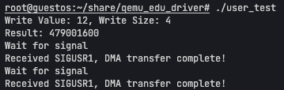

# EDU 虚拟设备及驱动详解

EDU 设备是 QEMU 中的一个 PCI 虚拟设备，本来是 Masaryk University 用来给学生编写内核驱动模块的的教育设备。该设备包括了 IRQ，DMA 等特性的模拟，因此能够让大家对设备与驱动之间的交互有一个更加全面的认识

本教程包括了 QEMU 中 EDU 设备的代码详解，以及针对这个 EDU 设备编写的 Linux 内核驱动的详解。

## EDU 设备虚拟

EDU 虚拟设备被放在[/hw/misc/edu.c](https://elixir.bootlin.com/qemu/v10.0.0/source/hw/misc/edu.c)。在讲述源码的时候，我将采取“模拟执行”的方式，针对不同的“事件”来梳理代码。

首先来看最主要的结构体`EduState`，该结构体就是抽象地描述了 EDU 这个设备。

```c
struct EduState {
    // 继承父PCI设备
    PCIDevice pdev;
    // 指定Memory-Mapped I/O内存区域
    MemoryRegion mmio;
    // 用于在qemu中开启一个线程
    QemuThread thread;
    QemuMutex thr_mutex;
    QemuCond thr_cond;
    // 设备是否处于正在关闭状态
    bool stopping;

    uint32_t addr4;
    uint32_t fact;
    uint32_t status;
    // 中断状态码
    uint32_t irq_status;
    // DMA状态
    struct dma_state {
        dma_addr_t src;
        dma_addr_t dst;
        dma_addr_t cnt;
        dma_addr_t cmd;
    } dma;
    QEMUTimer dma_timer;
    // DMA缓冲区
    char dma_buf[DMA_SIZE];
    // DMA掩码
    uint64_t dma_mask;
};
```

### 注册设备

用于注册设备的代码其实就是一行[`type_init(pci_edu_register_types)`](https://elixir.bootlin.com/qemu/v10.0.0/source/hw/misc/edu.c#L449)

这个宏会调用函数`pci_edu_register_types`

```c
static void pci_edu_register_types(void)
{
    // 在QEMU设备模型中用于声明设备实现的接口
    static InterfaceInfo interfaces[] = {
        // 表示EDU是一个传统的PCI设备
        { INTERFACE_CONVENTIONAL_PCI_DEVICE },
        // 表示数组结束
        { },
    };
    static const TypeInfo edu_info = {
        .name          = TYPE_PCI_EDU_DEVICE,   // 设备名
        .parent        = TYPE_PCI_DEVICE,       // 父设备
        .instance_size = sizeof(EduState),      // 设备实例大小
        .instance_init = edu_instance_init,     // 设备初始化方法
        .class_init    = edu_class_init,        // 设备类型初始化方法
        .interfaces = interfaces,               // 设备接口
    };

    // 注册设备
    type_register_static(&edu_info);
}
```

### 初始化设备

我们看到有两个初始化函数：`class_init`和`instance_init`，这里 qemu 会先执行`class_init`，进行类级别的初始化，设置设备类的通用属性和方法，然后执行`instance_init`，进行实例级别的初始化，设置具体设备实例的属性和状态。这样做是为了设备类只需要初始化一次，而只可以初始化多个设备实例，每个实例都可以有自己独立的状态。

#### class_init

```c
static void edu_class_init(ObjectClass *class, void *data)
{
    // 用于设备设备通用属性
    DeviceClass *dc = DEVICE_CLASS(class);
    // 用于设置PCI设别特定属性
    PCIDeviceClass *k = PCI_DEVICE_CLASS(class);

    // 设置初始化回调函数，当设备被实例化的时候会调用
    k->realize = pci_edu_realize;
    // 设置释放回调函数，当设备销毁时会调用
    k->exit = pci_edu_uninit;
    // 设置设备的属性
    k->vendor_id = PCI_VENDOR_ID_QEMU; // 厂商ID
    k->device_id = 0x11e8; // 设备ID
    k->revision = 0x10; // 设备版本号
    k->class_id = PCI_CLASS_OTHERS; // 设备类型为“其他类型”
    // 设置设备分类为MISC（杂项设备）
    set_bit(DEVICE_CATEGORY_MISC, dc->categories);
}
```

#### instance_init

```c
static void edu_instance_init(Object *obj)
{
    EduState *edu = EDU(obj);
    // 设置dma_mask为28位的1
    edu->dma_mask = (1UL << 28) - 1;
    /*
    为obj这个对象添加一个名为dma_mask的属性，
    这个属性是指向edu->dma_mask的指针，
    设置了OBJ_PROP_FLAG_READWRITE标志，表示这个属性可读可写
    将该DMA掩码作为对象的可读写属性暴露出去，
    使得外部可以通过QEMU的对象属性接口来访问和修改这个值
    */
    object_property_add_uint64_ptr(obj, "dma_mask",
                                   &edu->dma_mask, OBJ_PROP_FLAG_READWRITE);
}
```

#### realize

在设备实例化时会调用这个 realize 函数，进行实例化

```c
static void pci_edu_realize(PCIDevice *pdev, Error **errp)
{
    EduState *edu = EDU(pdev);
    uint8_t *pci_conf = pdev->config;
    // 设置PCI配置空间中的中断引脚（Interrupt Pin）为1，表示设备使用INTA#引脚触发中断
    pci_config_set_interrupt_pin(pci_conf, 1);

    // 初始化MSI（Message signaled Interrupts）中断
    if (msi_init(pdev, 0, 1, true, false, errp)) {
        return;
    }

    // 初始化DMA定时器，当调用timer_mod的时候就会执行edu_dma_timer函数
    timer_init_ms(&edu->dma_timer, QEMU_CLOCK_VIRTUAL, edu_dma_timer, edu);

    // 初始化互斥锁和条件变量用于线程同步
    qemu_mutex_init(&edu->thr_mutex);
    qemu_cond_init(&edu->thr_cond);

    // 开启一个线程，edu_fact_thread是计算阶乘的函数，是一个实际的业务函数，传入的参数是edu
    qemu_thread_create(&edu->thread, "edu", edu_fact_thread,
                       edu, QEMU_THREAD_JOINABLE);

    // 初始化初始化MMIO（Memory-Mapped I/O）区域
    // 大小为1M，名称为edu-mmio
    // 操作函数集合是edu_mmio_ops
    memory_region_init_io(&edu->mmio, OBJECT(edu), &edu_mmio_ops, edu,
                    "edu-mmio", 1 * MiB);
    // 注册PCI BAR
    pci_register_bar(pdev, 0, PCI_BASE_ADDRESS_SPACE_MEMORY, &edu->mmio);
}
```

#### MMIO 的初始化

我们使用了函数`memory_region_init_io`来完成 MMIO 的初始化

```c
memory_region_init_io(&edu->mmio, OBJECT(edu), &edu_mmio_ops, edu,
                    "edu-mmio", 1 * MiB);
```

其中我们需要为 mmio 区域绑定读写函数，读写函数被放到结构体`MemoryRegionOps`中：

```c
static const MemoryRegionOps edu_mmio_ops = {
    .read = edu_mmio_read,    // 读函数
    .write = edu_mmio_write,  // 写函数
    .endianness = DEVICE_NATIVE_ENDIAN,   // 设备指定为小端
    // 指定每次读写设备的大小范围
    .valid = {
        .min_access_size = 4,
        .max_access_size = 8,
    },
    .impl = {
        .min_access_size = 4,
        .max_access_size = 8,
    },
};
```

具体的读写函数我们放在后面详细说。


#### 启动业务逻辑

在`pci_edu_realize`函数中，会创建一个线程，开始执行`edu_fact_thread`。该业务逻辑函数中涉及到的中断等细节，将在后面介绍。

```c
/*
 * We purposely use a thread, so that users are forced to wait for the status
 * register.
 */
static void *edu_fact_thread(void *opaque)
{
    EduState *edu = opaque;
    
    while (1) {
        uint32_t val, ret = 1;
        // 先获取thr_mutex互斥锁，表示想要进行计算操作
        qemu_mutex_lock(&edu->thr_mutex);
        // 原子读这个edu->status，如果计算位（EDU_STATUS_COMPUTING）为0，且设备还没有停止
        // 那么就一直等待
        while ((qatomic_read(&edu->status) & EDU_STATUS_COMPUTING) == 0 &&
                        !edu->stopping) {
            // 使用条件变量，将该线程阻塞，同时释放thr_mutex这个互斥锁
            // 这个时候，edu_fact_thread就会停在这里，等待用户设置edu->status的计算位为1
            qemu_cond_wait(&edu->thr_cond, &edu->thr_mutex);
        }
        // 如果设备正在退出
        if (edu->stopping) {
            // 释放当前占有的互斥锁
            qemu_mutex_unlock(&edu->thr_mutex);
            break;
        }
        // 获取用户指定的要计算阶乘的数
        val = edu->fact;
        // 这时候，针对互斥资源edu->status, edu->stopping, edu->fact的修改已经结束
        // 所以可以释放掉互斥锁
        qemu_mutex_unlock(&edu->thr_mutex);
        
        // 进行实际的业务逻辑：计算阶乘
        while (val > 0) {
            ret *= val--;
        }

        /*
         * We should sleep for a random period here, so that students are
         * forced to check the status properly.
         */
        // 要修改edu->fact，所以要重新占有互斥锁
        qemu_mutex_lock(&edu->thr_mutex);
        // 将计算得出的结果复制到edu->fact，以供用户读取
        edu->fact = ret;
        qemu_mutex_unlock(&edu->thr_mutex);
        // 原子化and，将edu->status的计算位置为0
        qatomic_and(&edu->status, ~EDU_STATUS_COMPUTING);

        /* Clear COMPUTING flag before checking IRQFACT.  */
        // 内存屏障函数，用于多核处理器环境中保证访问的顺序性
        // 在这里是为了保证qatomic_read不会被重排到qatomic_and之前
        // 从而正确地模拟真实硬件中的严格的数据访问顺序
        smp_mb__after_rmw();
        
        // 读取edu->status，查看是否需要发起中断信号
        // 如果设置了，那么当计算完成后就会发起一个中断信号，
        // 告诉cpu，这个任务已经结束，反之就什么也不做
        if (qatomic_read(&edu->status) & EDU_STATUS_IRQFACT) {
            bql_lock();
            edu_raise_irq(edu, FACT_IRQ);
            bql_unlock();
        }
    }

    return NULL;
}
```

### 释放设备

释放设备时会调用`pci_edu_uninit`函数，释放之前申请的资源

```c
static void pci_edu_uninit(PCIDevice *pdev)
{
    // 获取EDU设备状态结构体
    EduState *edu = EDU(pdev);

    // 1. 停止工作线程
    qemu_mutex_lock(&edu->thr_mutex);    // 获取线程互斥锁
    edu->stopping = true;                // 设置停止标志
    qemu_mutex_unlock(&edu->thr_mutex);  // 释放互斥锁
    qemu_cond_signal(&edu->thr_cond);    // 发送条件变量信号唤醒可能等待的线程
    qemu_thread_join(&edu->thread);       // 等待线程结束

    // 2. 销毁同步对象
    qemu_cond_destroy(&edu->thr_cond);   // 销毁条件变量
    qemu_mutex_destroy(&edu->thr_mutex); // 销毁互斥锁

    // 3. 停止DMA定时器
    timer_del(&edu->dma_timer);          // 删除定时器

    // 4. 取消MSI中断初始化
    msi_uninit(pdev);                   // 取消MSI中断设置
}
```

### MMIO 读

对于操作系统而言，MMIO 区域会被映射到主存地址空间中，我们可以使用`mov`之类的命令，向像操作普通内存一样进行设备的读写。
当我们进行设备读的时候，就会触发这个`edu_mmio_read`函数。

```c
static uint64_t edu_mmio_read(void *opaque, hwaddr addr, unsigned size)
{
    EduState *edu = opaque;
    uint64_t val = ~0ULL;
    // 检查读取的地址范围，当小于0x80时，是进行普通的设备读，
    // 此时设备读只支持4字节读
    if (addr < 0x80 && size != 4) {
        return val;
    }
    // 当读的地址大于0x80时，支持4字节读或8字节读
    if (addr >= 0x80 && size != 4 && size != 8) {
        return val;
    }
    // 根据读的地址，返回不同的值
    switch (addr) {
    case 0x00:
        val = 0x010000edu;
        break;
    case 0x04:
        val = edu->addr4;
        break;
    case 0x08:
        // 读取edu计算后的阶乘值fact
        qemu_mutex_lock(&edu->thr_mutex);
        val = edu->fact;
        qemu_mutex_unlock(&edu->thr_mutex);
        break;
    case 0x20:
        // 读取当前设备的状态
        val = qatomic_read(&edu->status);
        break;
    case 0x24:
        // 读取当前设备的中断状态
        val = edu->irq_status;
        break;
        ....
    }
    return val;
}
```

### MMIO 写

当操作系统进行MMIO写的时候，就会执行函数`edu_mmio_write`，以下列出的几个，相当于是IO端口，暴露出几个寄存器，便于操作系统与设备进行交互。

```c
static void edu_mmio_write(void *opaque, hwaddr addr, uint64_t val,
                unsigned size)
{
    EduState *edu = opaque;
    ...
    switch (addr) {
    case 0x04:
        edu->addr4 = ~val;
        break;
    case 0x08:
        // 如果当前设备正在执行计算，那么会忽略本次写操作
        if (qatomic_read(&edu->status) & EDU_STATUS_COMPUTING) {
            break;
        }
        /* EDU_STATUS_COMPUTING cannot go 0->1 concurrently, because it is only
         * set in this function and it is under the iothread mutex.
         */
        // 获取互斥锁
        qemu_mutex_lock(&edu->thr_mutex);
        // 修改edu->fact的值，相当于是用户赋值，告诉edu设备，我现在要计算val这个数的阶乘
        edu->fact = val;
        // 设置设备状态的计算位为1，表示让设备开始计算
        qatomic_or(&edu->status, EDU_STATUS_COMPUTING);
        // 唤醒阻塞中的线程（edu_fact_thread）,唤醒后的线程会重新请求互斥锁thr_mutex，
        // 但是此时锁被edu_mmio_write这里占有
        qemu_cond_signal(&edu->thr_cond);
        // 所以我们在唤醒之后，就需要立即释放锁thr_mutex，以便让设备edu开始计算
        qemu_mutex_unlock(&edu->thr_mutex);
        break;
    case 0x20:
        // 开启/关闭 计算完成后是否触发中断
        // 如果val的值中的IRQFACT位为1
        if (val & EDU_STATUS_IRQFACT) {
            // 设置edu->status的IRQFACT位为1
            qatomic_or(&edu->status, EDU_STATUS_IRQFACT);
            /* Order check of the COMPUTING flag after setting IRQFACT.  */
            // 内存屏障，保证执行顺序，防止其他的qatomic_read在qatomic_or之前
            smp_mb__after_rmw();
        } else {
            // 否则设置edu->status的IRQFACT位为0
            qatomic_and(&edu->status, ~EDU_STATUS_IRQFACT);
        }
        break;
    case 0x60:
        // 触发中断信号
        edu_raise_irq(edu, val);
        break;
    case 0x64:
        // 清除中断信号
        edu_lower_irq(edu, val);
        break;
    }
}
```

### 中断

EDU设备中，多处用到了中断。

#### 中断的触发与清除

中断的触发与清除是通过`edu_raise_irq`和`edu_lower_irq`函数来实现的。其中值的关注的是，MSI中断和传统中断的选择。二者的比较可以见后面的描述。

```c
static void edu_raise_irq(EduState *edu, uint32_t val)
{
    edu->irq_status |= val;  // 设置中断状态位
    if (edu->irq_status) {  // 如果有中断待处理
        if (edu_msi_enabled(edu)) {  // 检查是否使用MSI
            msi_notify(&edu->pdev, 0);  // 发送MSI中断
        } else {
            pci_set_irq(&edu->pdev, 1);  // 使用传统中断方式
        }
    }
}

static void edu_lower_irq(EduState *edu, uint32_t val)
{
    edu->irq_status &= ~val;  // 清除中断状态位
    
    if (!edu->irq_status && !edu_msi_enabled(edu)) {  // 无中断且使用传统方式
        pci_set_irq(&edu->pdev, 0);  // 清除中断线
    }
}
```

在`edu_raise_irq`函数中，我们触发了中断。

如果**设备不支持MSI**，那么就会通过调用`pci_set_irq`来触发中断。函数`pci_set_irq(pdev, 1)`会拉高中断线触发中断，中断控制器（如8259A PIC或APIC）会检测到这个电平变化，然后向CPU发送中断信号。CPU每执行完一条指令后，都会检查INTR引脚，如果发现有中断信号且中断未被屏蔽（IF标志位为1），CPU就会响应中断，通过中断向量表找到对应的中断服务程序（ISR），然后执行。执行完之后，就会调用`pci_set_irq(pdev, 0)`清除中断信号。值得注意的是，使用`pci_set_irq`这种传统中断方式，其实只在共享一条中断信号线，所以我们需要单独申明一个`irq_status`来记录中断向量，以确定中断对应的事务。

如果**设备支持MSI**，那么就会调用`msi_notify(pdev, 0)`。该函数会构造一个MSI消息，通过PCI将其写入到特定的MSI目标地址中。当CPU执行完当前指令后，会检查MSI目标地址中的消息，如果发现有新的消息，CPU就会响应中断，通过中断向量表找到对应的中断服务程序（ISR），然后执行。执行完之后，就会清除MSI消息。MSI提供了更加高效的的中断处理方式。

在`edu_lower_irq`函数中，我们清除了中断。

如果**设备不支持MSI**，那么就会通过调用`pci_set_irq(pdev, 0)`来清除中断。函数`pci_set_irq(pdev, 0)`会拉低中断线，从而清除中断信号。

如果**设备支持MSI**，那就什么也不用做，因为与传统中断不同，MSI不需要通过物理电平信号触发，而是通过内存写入（Message）触发，本就是一次PCI写操作，因而无需额外的清除操作。

总的来说，以上两个函数封装了MSI中断和传统中断，使得驱动程序可以方便地触发和清除中断。

#### 用户通过读写IO端口触发或清除中断

在`edu_mmio_write`函数中，我们可以看到，当用户写入`0x60`这个寄存器的时候，就会触发中断，当写入`0x64`这个寄存器的时候就会清除对应的中断。

```c
static void edu_mmio_write(void *opaque, hwaddr addr, uint64_t val,
                unsigned size)
{
    EduState *edu = opaque;
    ...
    switch (addr) {
        ...
    case 0x60:
        edu_raise_irq(edu, val);
        break;
    case 0x64:
        edu_lower_irq(edu, val);
        break;
        ...
    }
}
```

#### 任务执行结束时唤起中断

用户可以通过向`0x20`这个寄存器写入`EDU_STATUS_IRQFACT`这个值，来开启任务完成中断。

```c
static void edu_mmio_write(void *opaque, hwaddr addr, uint64_t val,
                unsigned size)
{
    EduState *edu = opaque;
    ...
    switch (addr) {
        ...
    case 0x20:
        // 如果val中的EDU_STATUS_IRQFACT位为1
        if (val & EDU_STATUS_IRQFACT) {
            // 那么就开启中断，任务结束之后就会触发一个中断
            qatomic_or(&edu->status, EDU_STATUS_IRQFACT);
            /* Order check of the COMPUTING flag after setting IRQFACT.  */
            smp_mb__after_rmw();
        } else {
            // 否则就关闭中断
            qatomic_and(&edu->status, ~EDU_STATUS_IRQFACT);
        }
        break;
        ...
    }
}
```

当任务执行完成后，EDU设备会自动触发中断，这样操作系统就知道计算任务完成了。

```c
static void *edu_fact_thread(void *opaque)
{
    EduState *edu = opaque;
    while (1) {
        ...
        // 当计算完成后，会检查edu->status的IRQFACT位是否为1，
        // 如果为1，那么说明用户开启了任务结束后触发中断的功能
        if (qatomic_read(&edu->status) & EDU_STATUS_IRQFACT) {
            // 中断处理涉及到多个组件交互，因此申请Big Qemu Lock，
            // 保证修改设备中断的操作具有原子性，防止其他组件干扰
            bql_lock();
            // 修改中断状态，触发FACT_IRQ中断
            edu_raise_irq(edu, FACT_IRQ);
            bql_unlock();
        }
    }
}
```

#### MSI 和传统中断对比

MSI（Message Signaled Interrupts，消息信号中断）和传统的中断（如 PCI 的 INTx#引脚中断）是两种不同的中断触发机制，它们在实现方式、性能和适用场景上有显著区别。以下是它们的核心差异：

1. **触发方式**

- **传统中断（INTx#）**

  - 通过物理引脚（INTA#、INTB#等）发送电平信号通知 CPU。
  - 需要中断控制器（如 8259 PIC 或 APIC）仲裁和路由。
  - 例如：PCI 设备的`pci_config_set_interrupt_pin(pci_conf, 1)`设置了 INTA#引脚。

- **MSI**
  - 通过**写入内存地址**（向特定的 MSI 目标地址写入数据）触发中断，无需物理引脚。
  - 数据中包含中断向量号，直接通知 CPU，绕过中断控制器。
  - 例如：`msi_init(pdev, 0, 1, true, false, errp)`启用了 MSI。

2. **性能对比**

   | **特性**       | **传统中断 (INTx#)**               | **MSI/MSI-X**                    |
   | -------------- | ---------------------------------- | -------------------------------- |
   | **延迟**       | 较高（需引脚电平切换和控制器仲裁） | 更低（直接内存写入，无物理延迟） |
   | **共享冲突**   | 多个设备可能共享同一引脚导致冲突   | 每个中断独立，无共享问题         |
   | **多中断支持** | 仅支持单中断（如 INTA#）           | 支持多个中断向量（MSI-X 更灵活） |
   | **吞吐量**     | 低（频繁中断可能饱和引脚）         | 高（适合高速设备如 NVMe、网卡）  |

3. **工作原理**

- **传统中断**

  ```
  设备 → 物理引脚电平触发 → 中断控制器 → CPU响应
  ```

  - 需要处理共享引脚（多个设备可能共用 INTA#），可能导致中断风暴。

- **MSI**
  ```
  设备 → 写入特定内存地址（含向量号） → CPU直接响应
  ```
  - 完全避免引脚冲突，适合高吞吐场景（如 DMA 操作）。

4. **为什么需要 MSI？**

- **解决传统中断的瓶颈**：
  - 共享引脚导致性能下降（如多网卡场景）。
  - 电平触发可能丢失中断（需 CPU 确认后才能清除）。
- **适应高速设备**：
  - 如万兆网卡、NVMe SSD 需要低延迟、高吞吐的中断机制。

在代码中我们分别设置了传统中断和 MSI 中断

```c
pci_config_set_interrupt_pin(pci_conf, 1);  // 传统INTx#（INTA#）
msi_init(pdev, 0, 1, true, false, errp);   // 启用MSI（1个向量）
```

- 如果同时配置，设备会优先使用 MSI（现代 OS 通常首选 MSI）。
- MSI 参数`1`表示支持 1 个中断向量，而 MSI-X 可支持更多（如 NVMe 设备可能用几十个向量）。

简单来说，MSI 和传统中断的对比如下：

- **传统中断**：简单但性能低，适合老旧设备。
- **MSI/MSI-X**：高性能、可扩展，是现代 PCIe 设备的标配。
  在虚拟化中，MSI 能减少模拟中断控制器的开销，提升性能。

MSI架构具有以下优势：

- 没有电平维持问题，不会产生"中断风暴"
- 每个MSI中断都是独立的事务(transaction)
- 支持精确的中断向量传递，无需共享中断线


### DMA

DMA（Direct Memory Access，直接内存访问）是一种计算机系统中用于高效数据传输的技术。它允许某些硬件子系统（如磁盘控制器、网卡、显卡等）直接访问系统内存，而无需通过CPU的介入。这里我们减少概念性的讲解，主要关注一下DMA如何实现。

#### DMA IO端口

mmio中定义了DMA相关的IO端口，如下。以下只罗列mmio写入的DMA IO端口，读与写类似，就不赘述了。

```c
static void edu_mmio_write(void *opaque, hwaddr addr, uint64_t val,
                unsigned size)
{
    EduState *edu = opaque;
    ...
    switch (addr) {
    ...
    case 0x80:
        // 写入DMA源地址
        dma_rw(edu, true, &val, &edu->dma.src, false);
        break;
    case 0x88:
        // 写入DMA目的地址
        dma_rw(edu, true, &val, &edu->dma.dst, false);
        break;
    case 0x90:
        // 写入DMA传输的字节数
        dma_rw(edu, true, &val, &edu->dma.cnt, false);
        break;
    case 0x98:
        // 写入DMA命令
        // 目前命令中包含EDU_DMA_RUN，EDU_DMA_FROM_PCI和EDU_DMA_IRQ三个标志位
        // EDU_DMA_RUN：表示DMA传输是否开始，如果这个位为0，
        // EDU_DMA_FROM_PCI：表示DMA传输的方向，如果这个位为0，表示从内存到设备，如果为1，表示从设备到内存
        // EDU_DMA_IRQ：表示DMA传输完成后是否触发中断，如果这个位为0，表示不触发中断，如果为1，表示触发中断
        // 说明用户没有要开启DMA，因此直接返回
        if (!(val & EDU_DMA_RUN)) {
            break;
        }
        // 否则设置DMA的命令，之前的写都是更改DMA的配置（src，dst，cnt），所以timer参数为false
        // 但是到了这里，是修改DMA的命令，修改了命令之后，就需要启动DMA定时器，执行DMA操作
        // 因此这里的timer参数为true
        dma_rw(edu, true, &val, &edu->dma.cmd, true);
        break;
    }
}
```

其中的`dma_rw`函数，是一个通用的DMA读写IO端口的函数，用于配置DMA的源地址、目的地址、传输字节数和命令。

```c
static void dma_rw(EduState *edu, bool write, dma_addr_t *val, dma_addr_t *dma,
                bool timer)
{
    // 如果是要修改DMA的配置，但是此时DMA正在执行（dma.cmd能够反映DMA当前运行状态）
    // 那么此时修改DMA的配置会发生错误，因此就直接返回
    if (write && (edu->dma.cmd & EDU_DMA_RUN)) {
        return;
    }
    // 读/写dma的配置
    if (write) {
        *dma = *val;
    } else {
        *val = *dma;
    }
    // 触发DMA定时器，用于DMA的定时操作
    // 当timer为真时，会触发一个定时器，定时器的时间间隔为100ms，
    if (timer) {
        timer_mod(&edu->dma_timer, qemu_clock_get_ms(QEMU_CLOCK_VIRTUAL) + 100);
    }
}
```

#### DMA 读写

DMA的读写是通过函数`edu_dma_timer`来实现的。该函数会在定时器触发时执行。

```c
static void edu_dma_timer(void *opaque)
{
    EduState *edu = opaque;
    bool raise_irq = false;
    // 如果DMA的命令中没有EDU_DMA_RUN位，那么就直接返回
    // 表示DMA没有被用户指定开始运行，因而无需执行DMA操作
    if (!(edu->dma.cmd & EDU_DMA_RUN)) {
        return;
    }

    // 检查DMA的方向，是从设备到内存（EDU_DMA_FROM_PCI），还是从内存到设备（EDU_DMA_TO_PCI）
    // 如果是从设备到内存，那么就从设备的地址（edu->dma.dst）读取数据到内存的地址（edu->dma.src）
    if (EDU_DMA_DIR(edu->dma.cmd) == EDU_DMA_FROM_PCI) {
        uint64_t dst = edu->dma.dst;
        // 先检查读取DMA的地址范围是否合法
        edu_check_range(dst, edu->dma.cnt, DMA_START, DMA_SIZE);
        // 将读取的地址减去DMA_START，得到相对于DMA_START的偏移量
        dst -= DMA_START;
        // 执行DMA读取操作，将设备的数据读取到内存中
        // 这里的pci_dma_read函数，是一个PCI设备的DMA读取函数，用于从PCI设备的内存中读取数据
        pci_dma_read(&edu->pdev, edu_clamp_addr(edu, edu->dma.src),
                edu->dma_buf + dst, edu->dma.cnt);
    } 
    // 反之，如果是从内存到设备，那么就从内存的地址（edu->dma.dst）读取数据到设备的地址（edu->dma.src）
    else {
        uint64_t src = edu->dma.src;
        // 先检查写入DMA的地址范围是否合法
        edu_check_range(src, edu->dma.cnt, DMA_START, DMA_SIZE);
        // 将写入的地址减去DMA_START，得到相对于DMA_START的偏移量
        src -= DMA_START;
        // 执行DMA写入操作，将内存的数据写入到设备中
        pci_dma_write(&edu->pdev, edu_clamp_addr(edu, edu->dma.dst),
                edu->dma_buf + src, edu->dma.cnt);
    }

    // 当DMA操作完成后，就会修改DMA的命令，将EDU_DMA_RUN位清零
    // 同时，如果EDU_DMA_IRQ位为1，那么就会设置raise_irq为true，
    edu->dma.cmd &= ~EDU_DMA_RUN;
    if (edu->dma.cmd & EDU_DMA_IRQ) {
        raise_irq = true;
    }
    // 如果raise_irq为true，那么就触发DMA中断，提醒CPU已经完成了DMA操作
    if (raise_irq) {
        edu_raise_irq(edu, DMA_IRQ);
    }
}
```

### 总结

至此EDU虚拟设备的实现就完成了。

- 实现了MMIO读写
- 实现了中断触发和清除
- 实现了DMA读写

有不清楚的地方，建议多看看源码～

## EDU 设备驱动

:::{important}
以下介绍的设备驱动代码作者是[jklincn](https://jklincn.com/)，[源码仓库](https://github.com/jklincn/qemu_edu_driver)
:::

### 注册设备驱动

在注册驱动部分，实际上我们是在编写一个Linux内核模块，因此需要实现最基本的内核模块的注册

```c
// 定义该驱动支持的设备的厂商ID和设备ID（0x1234, 0x11e8）
static struct pci_device_id pci_ids[] = {{PCI_DEVICE(0x1234, 0x11e8)},{0,}};
// 将设别ID表导出道模块信息中，使得内核可以在驱动加载时知道它支持哪些设备
MODULE_DEVICE_TABLE(pci, pci_ids);

// 定义设备驱动结构体
static struct pci_driver pci_driver = {
    // 驱动名称
    .name = DRIVER_NAME, 
    // 支持的设备（其中包含了Vendor ID， Device ID）
    // 内核通过这个表来匹配驱动和设备
    .id_table = pci_ids, 
    // 设备初始化
    // 当内核发现一个PCI设备与 id_table 中的某个条目匹配时
    // 就会调用该函数进行初始化
    .probe = edu_probe, 
    // 当驱动卸载或设备被移除（如热插拔）时，
    // 就会调用该函数进行资源的回收清理
    .remove = edu_remove,
};

// 注册PCI驱动，会在insmod、modprobe、系统启动时调用
static int __init edu_init(void) {
  int ret;
  if ((ret = pci_register_driver(&pci_driver)) < 0) {
    printk(KERN_ERR "[%s] Init failed. \n", DRIVER_NAME);
    return ret;
  }

  printk(KERN_INFO "[%s] Init sucessfully. \n", DRIVER_NAME);
  return ret;
}

// 注销PCI驱动
// rmmod、系统关闭时调用
static void __exit edu_exit(void) {
  pci_unregister_driver(&pci_driver);
  printk(KERN_INFO "[%s] exited. \n", DRIVER_NAME);
}

module_init(edu_init);
module_exit(edu_exit);

MODULE_LICENSE("GPL");
MODULE_DESCRIPTION("QEMU EDU Device Driver");
```

### 初始化设备

设备驱动的初始化主要是通过`edu_probe`这个函数完成的，该函数会依次进行启用PCI设备、申请设备资源、初始化设备数据结构、注册字符设备、映射 MMIO、设置 DMA、注册中断处理函数、创建设备文件节点

#### 分配设备结构体

```c
// 使用kzalloc函数分配设备结构体
edu_dev = kzalloc(sizeof(*edu_dev), GFP_KERNEL);
if (!edu_dev)
    return -ENOMEM;
// 赋值父pdev
edu_dev->pdev = pdev;
```

#### 启用PCI设备

```c
// 启用PCI，使其可以被操作系统访问
if ((ret = pci_enable_device(pdev)) < 0) {
    printk(KERN_ERR "[%s] pci_enable_device failed. \n", DRIVER_NAME);
    goto free_edu_device;
}
```

#### 申请主设备号

在Linux中，每一个设备都需要通过主设备号（Major）和次设备号（Minor）作为唯一标识，有动态分配和静态分配两种方式。
动态分配使用`alloc_chrdev_region`让内核自动分配一个未使用的主设备号，这样会避免冲突。静态分配需要手动指定主设备号，但是需要我们自己处理冲突，因为可能其他驱动冲突。

```c
// 动态分配主设备号
if ((ret = alloc_chrdev_region(&dev_num, BASEMINOR, DEVICE_COUNTS,
                                 DRIVER_NAME)) < 0) {
    printk(KERN_ERR "[%s] Failed to allocate char device region\n",
            DRIVER_NAME);
    goto disable_device;
}
edu_dev->dev_num = dev_num;
```

#### 初始化字符设备

```c
// 定义了文件操作函数集
static struct file_operations fops = {.owner = THIS_MODULE,
                                      .read = edu_read,
                                      .write = edu_write,
                                      .open = edu_open      };

// 初始化字符设备
// 将fops与edu_dev->cdev绑定
// 当用户调用read("/dev/edu")就会调用fops->read (也就是edu_read)
cdev_init(&edu_dev->cdev, &fops);
edu_dev->cdev.owner = THIS_MODULE;

// 注册字符设备到内核
if (cdev_add(&edu_dev->cdev, edu_dev->dev_num, DEVICE_COUNTS)) {
    printk(KERN_ERR "[%s] Failed to add cdev\n", DRIVER_NAME);
    goto unregister_chrdev;
}
```

#### 初始化Class

在`/sys/class/`下创建一个设备类目录（如 `/sys/class/edu/`），用于统一管理同类设备

```c
edu_class = class_create(DRIVER_NAME);
if (IS_ERR(edu_class)) {
    printk(KERN_ERR "[%s] Failed to create class\n", DRIVER_NAME);
    ret = PTR_ERR(edu_class);
    goto delete_cdev;
}
```

#### 初始化设备节点

设备节点（Device Node）是用户空间和内核空间交互的桥梁，应用程序通过`read`，`open`，`write`访问设备，设备被当作一个文件进行读写。
传统方式需要我们手动运行`mknod /dev/edu c 259 0`来创建设备节点，现代的驱动通过`device_create`在驱动初始化阶段自动生成设备节点

```c
// 创建设备节点：/dev/edu
if (device_create(edu_class, NULL, edu_dev->dev_num, NULL, "edu") == NULL) {
    printk(KERN_ERR "[%s] Failed to create device node\n", DRIVER_NAME);
    ret = -EINVAL;
    goto destroy_class;
}
```

#### 初始化MMIO/IOP资源
BAR是PCI/PCIe设备的基地址寄存器，在PCI设备中很常用，每一个BAR都会对应一片内存空间。BAR一般有两种方式进行访问：MMIO和PIO。这里的BAR为0，表示申请了一个id为0的BAR。

以下代码先申请了一个BAR资源

```c
if ((ret = pci_request_region(pdev, BAR, DRIVER_NAME)) < 0) {
    printk(KERN_ERR "[%s] pci_request_region failed. \n", DRIVER_NAME);
    goto destroy_device;
}
```

然后将其使用pci_iomap进行映射，通过MMIO的方式访问BAR对应的内存区域。

```c
// 映射BAR对应的内存区域
mmio_base = pci_iomap(pdev, BAR, pci_resource_len(pdev, BAR));
if (!mmio_base) {
    printk(KERN_ERR "[%s] Cannot iomap BAR\n", DRIVER_NAME);
    ret = -ENOMEM;
    goto release_region;
}
edu_dev->mmio_base = mmio_base;
```

#### 初始化DMA

##### 设置DMA掩码

DMA（直接内存访问） 允许设备 绕过 CPU 直接读写内存，提高数据传输效率（如网卡收发包、磁盘读写）。设备通过DMA地址访问内存，但是**不能访问任意地址**（受硬件限制）
因此我们就通过设置DMA掩码来限制设备可访问的内存范围。例如`DMA_BIT_MASK(28)`表示，我们只能访问`0x00000000`~`0x0FFFFFFF`（256M）的物理地址，如果超出这个限制，就会导致总线异常。此外现代的操作系统一般都是64位的，一些旧设备可能只支持32位，因此驱动可以使用DMA掩码来动态调整，提高驱动程序的兼容性。

这里我们使用了`dma_set_mask_and_coherent`函数来同时设置流式DMA和一致性DMA的掩码。流式DMA和一致性DMA区别如下，仅供参考：

| 特性         | 流式 DMA（Streaming DMA）                      | 一致性 DMA（Coherent DMA）                 |
| ------------ | ---------------------------------------------- | ------------------------------------------ |
| **用途**     | 短期、高速数据传输（如网络包、磁盘 I/O）。     | 长期共享内存（如设备控制块、环形缓冲区）。 |
| **缓存行为** | **无缓存一致性**，需手动同步（`dma_sync_*`）。 | **硬件维护缓存一致性**，无需手动同步。     |
| **内存分配** | `dma_map_single`/`dma_map_page`。              | `dma_alloc_coherent`。                     |
| **性能**     | 更高（避免缓存一致性开销）。                   | 较低（硬件或软件需维护一致性）。           |
| **适用场景** | 频繁传输的临时数据。                           | 设备与 CPU 长期共享的稳定数据结构。        |

```c
// 设置DMA掩码
// EDU设备默认只支持28位
if ((ret = dma_set_mask_and_coherent(&(pdev->dev), DMA_BIT_MASK(28))) < 0) {
    dev_warn(&pdev->dev, "[%s] No suitable DMA available\n", DRIVER_NAME);
    goto release_region;
}
```

##### 启动DMA

我们调用了函数`pci_set_master`，函数用于 启用 PCI 设备的 DMA 主控（Bus Master）模式，允许设备主动发起 DMA 操作（直接访问系统内存）。启用之后设备才可以主动读取内存（网卡主动接受数据，）或者写入内存（磁盘主动写入数据），未启用的话，设备只能响应CPU的IO操作，无法直接访问内存。

```c
pci_set_master(pdev);
```

#### 初始化中断请求（IRQ）

这里我们启用了中断请求，其中的中断处理函数`edu_irq_handler`将在后面介绍

```c
if ((ret = request_irq(pdev->irq, edu_irq_handler, IRQF_SHARED, DRIVER_NAME,
                         edu_dev)) < 0) {
    printk(KERN_ERR "[%s] Failed to request IRQ %d\n", DRIVER_NAME, pdev->irq);
    goto unmap_bar;
}
```

#### 通过IO端口配置设备

有两个地方值得一说，一个是通过函数`iowrite32`对edu设备的IO端口进行配置，这里的`EDU_STATUS`是0x20，正好对应了前文在解释edu设备时候说到的，对edu->status的修改。所以驱动模块写入的`STATUS_IRQFACT`会通过`edu_mmio_write`，将这个值与edu->status进行或运算，从而将对应的位置为1

另一个就是，在初始化阶段，我们初始化了一个工作项（edu_dev->free_dma_work）将其与实际执行DMA的回调函数（free_dma_work_fn）进行绑定。我们在这里只是初始化了工作项，在系统进行中断处理的时候，会调用`schedule_work()`函数触发执行。

```c
// 初始化设备，配置其在完成阶乘计算之后，触发一个中断
iowrite32(STATUS_IRQFACT, edu_dev->mmio_base + EDU_STATUS);
// 初始化等待队列
init_waitqueue_head(&edu_dev->wait_queue);
// 初始时将complete设置为true，表示设备已经完成计算
edu_dev->complete = true;
// 初始化工作队列
INIT_WORK(&edu_dev->free_dma_work, free_dma_work_fn);
```

### 释放设备

设备的释放主要是通过函数`edu_remove`实现，具体来说，就是`edu_probe`的逆操作，将所占有的资源正确的释放。

```c
static void edu_remove(struct pci_dev *pdev) {
  struct edu_device *edu_dev = pci_get_drvdata(pdev);

  // 释放 IRQ
  free_irq(pdev->irq, edu_dev);

  // 释放 BAR 内存
  pci_iounmap(pdev, edu_dev->mmio_base);

  // 释放 PCI I/O 资源
  pci_release_region(pdev, BAR);

  // 删除设备节点 /dev/edu
  device_destroy(edu_class, edu_dev->dev_num);

  // 销毁class
  class_destroy(edu_class);

  // 删除cdev
  cdev_del(&edu_dev->cdev);

  // 取消注册的char设备区域
  unregister_chrdev_region(edu_dev->dev_num, DEVICE_COUNTS);

  // 禁用PCI设备
  pci_disable_device(pdev);

  // 释放先前分配的设备结构体
  kfree(edu_dev);

  printk(KERN_INFO "[%s] removed.\n", DRIVER_NAME);
}
```

### 打开设备

```c
/**
 * edu_open - 打开edu设备的函数
 * @inode: 设备文件的inode结构指针
 * @filp: 设备文件结构指针
 * 
 * 功能:
 * 1. 通过inode获取对应的edu_device设备结构
 * 2. 记录当前打开设备的进程ID
 * 3. 将设备结构指针存储在filp->private_data中供后续操作使用
 * 
 * 返回值:
 * 成功返回0，失败返回负的错误码
 */
static int edu_open(struct inode *inode, struct file *filp) {
    struct edu_device *edu_dev;

    // 通过container_of宏从inode->i_cdev获取包含它的edu_device结构
    edu_dev = container_of(inode->i_cdev, struct edu_device, cdev);

    // 获取并存储当前进程的PID到设备结构中
    edu_dev->user_pid = get_pid(task_pid(current));

    // 将设备结构指针存储在filp->private_data中，供read/write/ioctl等操作使用
    filp->private_data = edu_dev;

    return 0;
}

```

其中我们获取到了edu_dev, 当我们在后续的读写函数中，需要使用到这个设备的时候，我们就可以通过`filp->private_data`获取到这个设备，从而进行后续的操作。它有以下几个好处：

1. **持久化访问**：在后续的`read`、`write`、`ioctl`等文件操作中，可以通过`filp->private_data`快速获取设备结构，避免重复查找
2. **上下文保持**：每个打开的文件描述符(filp)可以维护自己独立的设备状态
3. **线程安全**：不同进程/线程对同一设备的操作可以通过各自的filp隔离状态

这是Linux设备驱动开发中的常见模式，特别是对于字符设备驱动。


### 读设备

从设备中获取数据的操作是通过函数`edu_read`完成的，具体的实现过程如下：

```c
/**
 * edu_read - 从edu设备读取数据的函数
 * @filp: 设备文件结构指针
 * @buf: 用户空间缓冲区指针
 * @count: 请求读取的字节数
 * @ppos: 文件位置指针
 * 
 * 返回值:
 *  成功返回实际读取的字节数，失败返回负的错误码
 * 
 * 功能说明:
 * 1. 处理两种不同的读取操作：阶乘计算结果和DMA数据传输
 * 2. 对输入参数进行严格校验
 * 3. 使用copy_to_user安全地将数据从内核空间传输到用户空间
 */
static ssize_t edu_read(struct file *filp, char __user *buf, size_t count,
                        loff_t *ppos) {
    struct edu_device *edu_dev;
    uint32_t value32;

    /* 从file结构体的private_data获取设备特定数据 */
    edu_dev = filp->private_data;

    /* 
     * 参数校验:
     * - 偏移量<0x80时，只允许读取4字节
     * - 偏移量>=0x80时，允许读取4或8字节
     */
    if ((*ppos < 0x80 && count != 4) ||
        (*ppos >= 0x80 && count != 4 && count != 8)) {
        return -EINVAL;
    }

    /* 根据偏移量处理不同的读取操作 */
    switch (*ppos) {
        case EDU_FACT_CALC: {
            /* 等待阶乘计算完成 */
            int ret;
            ret = wait_event_interruptible(edu_dev->wait_queue,
                                           edu_dev->complete);
            /* 处理信号中断 */
            if (ret == -ERESTARTSYS) {
                return ret;
            }
            /* 从设备寄存器读取计算结果 */
            value32 = ioread32(edu_dev->mmio_base + EDU_FACT_CALC);
            /* 将结果拷贝到用户空间 */
            if (copy_to_user(buf, &value32, sizeof(value32))) {
                return -EFAULT;
            }
            break;
        }
        case EDU_DMA_GET: {
            /* 
             * DMA数据传输:
             * 将DMA缓冲区内容传输到用户指定的地址
             * 注意: 这里忽略常规的buf和count参数
             */
            if (copy_to_user((void __user *)edu_dev->dma_dst_address,
                             edu_dev->dma_buffer, edu_dev->dma_count)) {
                printk(KERN_ERR "[%s] DMA GET: Failed to copy_to_user\n",
                       DRIVER_NAME);
                return -EFAULT;
            }
            /* 记录DMA传输日志 */
            printk(KERN_INFO "[%s] DMA GET: Content: %s\n", DRIVER_NAME,
                   (char *)edu_dev->dma_buffer);
            break;
        }
        default:
            return -EINVAL;
    }

    /* 更新文件位置指针 */
    *ppos += count;

    return count;
}
```

### 写设备

写设备的操作是通过函数`edu_write`完成的。为了方便对设备的DMA相关寄存器进行操作，驱动提供了一个`SET_DMA`宏，实现如下：


```c
// 第一个参数是要写入的值，第二个参数是寄存器地址
#define SET_DMA(value64, pos)                                 \
    do {                                                      \
        iowrite32((uint32_t)((value64)&0xFFFFFFFF),           \
                  edu_dev->mmio_base + (pos));                \
        iowrite32((uint32_t)(((value64) >> 32) & 0xFFFFFFFF), \
                  edu_dev->mmio_base + (pos) + 4);            \
    } while (0)
```

写设备的具体实现过程如下：

```c
/**
 * @brief 向EDU设备写入数据
 * 
 * @param filp 文件指针，包含设备私有数据
 * @param buf 用户空间缓冲区指针
 * @param count 要写入的字节数
 * @param ppos 文件位置指针
 * @return ssize_t 成功时返回写入的字节数，失败时返回错误码
 */
static ssize_t edu_write(struct file *filp, const char __user *buf,
                         size_t count, loff_t *ppos) {
    struct edu_device *edu_dev;
    uint32_t value32 = 0;
    uint64_t value64 = 0;

    /**
     * @brief 获取设备结构体指针
     * 
     * 从文件指针filp的private_data字段获取edu_device结构体指针
     * 该指针在edu_open函数中被设置
     */
    edu_dev = filp->private_data;

    /**
     * @brief 从用户空间读取数据
     * 
     * 根据count和ppos的值决定读取32位还是64位数据
     * - 如果count为4字节，读取32位数据到value32
     * - 如果count为8字节且ppos >= EDU_DMA_SRC_ADDR，读取64位数据到value64
     * - 其他情况返回-EINVAL错误
     */
    if (count == 4) {
        if (copy_from_user(&value32, buf, sizeof(value32))) {
            return -EFAULT;
        }
    } else if (count == 8 && *ppos >= EDU_DMA_SRC_ADDR) {
        if (copy_from_user(&value64, buf, sizeof(value64))) {
            return -EFAULT;
        }
    } else {
        return -EINVAL;
    }

    /**
     * @brief 根据文件位置指针执行不同的写入操作
     * 
     * 使用switch语句根据ppos的值执行不同的设备操作
     */
    switch (*ppos) {
        case EDU_FACT_CALC:
            /**
             * @brief 阶乘计算
             * 
             * 1. 设置complete标志为false，表示计算未完成
             * 2. 将value32写入设备的EDU_FACT_CALC寄存器
             */
            edu_dev->complete = false;
            iowrite32(value32, edu_dev->mmio_base + EDU_FACT_CALC);
            break;
        case EDU_DMA_SRC_ADDR:
            /**
             * @brief 设置DMA源地址
             * 
             * 根据count的值设置32位或64位的DMA源地址
             */
            edu_dev->dma_src_address = count == 4 ? value32 : value64;
            break;
        case EDU_DMA_DST_ADDR: {
            /**
             * @brief 设置DMA目标地址
             * 
             * 根据count的值设置32位或64位的DMA目标地址
             */
            edu_dev->dma_dst_address = count == 4 ? value32 : value64;
            break;
        }
        case EDU_DMA_COUNT:
            /**
             * @brief 设置DMA传输字节数
             * 
             * 根据count的值设置32位或64位的DMA传输字节数
             */
            edu_dev->dma_count = count == 4 ? value32 : value64;
            break;
        case EDU_DMA_CMD: {
            void *buffer_addr;
            dma_addr_t dma_addr;
            struct device *dev = &edu_dev->pdev->dev;
            uint64_t cmd = count == 4 ? value32 : value64;

            /**
             * @brief 设置DMA传输字节数到寄存器
             */
            size_t size = edu_dev->dma_count;
            SET_DMA(size, EDU_DMA_COUNT);

            /**
             * @brief 准备DMA缓冲区
             * 
             * 1. 分配DMA一致性内存
             * 2. 如果分配失败，打印错误日志并返回-ENOMEM
             */
            buffer_addr = dma_alloc_coherent(dev, size, &dma_addr, GFP_KERNEL);
            if (!buffer_addr) {
                printk(KERN_ERR
                       "[%s] DMA_CMD: Failed to allocate memory for dma\n",
                       DRIVER_NAME);
                return -ENOMEM;
            }

            edu_dev->dma_buffer = buffer_addr;
            edu_dev->dma_direction = cmd & DMA_EDU2RAM;
            edu_dev->dma_addr = dma_addr;

            if (cmd & DMA_EDU2RAM) {
                /**
                 * @brief EDU到RAM的DMA传输
                 * 
                 * 1. 检查源地址是否在有效范围内
                 * 2. 设置DMA源地址和目标地址寄存器
                 * 3. 打印DMA启动日志
                 */
                if (edu_dev->dma_src_address < EDU_BUFFER_ADDRESS ||
                    edu_dev->dma_src_address + size >=
                        EDU_BUFFER_ADDRESS + BUFFER_SIZE) {
                    printk(KERN_ERR "[%s] DMA_CMD: Memory out of bounds\n",
                           DRIVER_NAME);
                    dma_free_coherent(dev, size, buffer_addr, dma_addr);
                    return -EFAULT;
                }
                // 设置DMA源地址寄存器
                SET_DMA(edu_dev->dma_src_address, EDU_DMA_SRC_ADDR);
                // 设置DMA目标地址寄存器
                SET_DMA(dma_addr, EDU_DMA_DST_ADDR);
                printk(KERN_INFO
                       "[%s] Start DMA: Direction: EDU to RAM, Source Address: "
                       "0x%llx, Destination Address: 0x%llx, count:%ld\n",
                       DRIVER_NAME, edu_dev->dma_src_address, dma_addr, size);
            } else {
                /**
                 * @brief RAM到EDU的DMA传输
                 * 
                 * 1. 检查目标地址是否在有效范围内
                 * 2. 从用户空间拷贝数据到DMA缓冲区
                 * 3. 设置DMA源地址和目标地址寄存器
                 * 4. 打印DMA启动日志
                 */
                if (edu_dev->dma_dst_address < EDU_BUFFER_ADDRESS ||
                    edu_dev->dma_dst_address + size >=
                        EDU_BUFFER_ADDRESS + BUFFER_SIZE) {
                    printk(KERN_ERR "[%s] DMA_CMD: Memory out of bounds\n",
                           DRIVER_NAME);
                    dma_free_coherent(dev, size, buffer_addr, dma_addr);
                    return -EFAULT;
                }
                // 从用户态获取数据
                if (copy_from_user(
                        buffer_addr,
                        (const void __user *)edu_dev->dma_src_address,
                        edu_dev->dma_count)) {
                    printk(KERN_ERR "[%s] DMA_CMD: Failed to copy_from_user\n",
                           DRIVER_NAME);
                    dma_free_coherent(dev, size, buffer_addr, dma_addr);
                    return -EFAULT;
                }
                
                SET_DMA(dma_addr, EDU_DMA_SRC_ADDR);
                SET_DMA(edu_dev->dma_dst_address, EDU_DMA_DST_ADDR);
                printk(KERN_INFO
                       "[%s] Start DMA: Direction: RAM to EDU, Source Address: "
                       "0x%llx, Destination Address: 0x%llx, count:%ld, "
                       "Content: %s\n",
                       DRIVER_NAME, dma_addr, edu_dev->dma_dst_address, size,
                       (char *)buffer_addr);
            }

            /**
             * @brief 启动DMA传输
             * 
             * 设置DMA_CMD寄存器，包含DMA方向和中断标志
             */
            SET_DMA(cmd | DMA_START | DMA_IRQ, EDU_DMA_CMD);

            break;
        }
        default:
            /**
             * @brief 处理无效的文件位置指针
             * 
             * 如果ppos不匹配任何已定义的case，返回-EINVAL错误
             */
            return -EINVAL;
    }

    /**
     * @brief 更新文件位置指针
     * 
     * 将ppos增加count，确保下次操作从正确位置开始
     */
    *ppos += count;

    /**
     * @brief 返回实际写入的字节数
     * 
     * 返回成功写入的字节数count
     */
    return count;
}
```

### IRQ处理

EDU设备的中断处理函数如下。在驱动程序初始化时，该函数就会被注册：

```c
// 注册中断处理函数
if ((ret = request_irq(pdev->irq, edu_irq_handler, IRQF_SHARED, DRIVER_NAME,
                        edu_dev)) < 0) {
    printk(KERN_ERR "[%s] Failed to request IRQ %d\n", DRIVER_NAME,
            pdev->irq);
    goto unmap_bar;
}
```

一旦设备发来中断信号，就会触发中断处理函数`edu_irq_handler`。

```c
/**
 * @brief EDU设备的中断处理函数
 * 
 * @param irq 中断号
 * @param dev_id 设备私有数据指针
 * @return irqreturn_t 中断处理结果
 * 
 * 该函数处理EDU设备产生的两种中断：
 * 1. 阶乘计算完成中断
 * 2. DMA传输完成中断
 */
static irqreturn_t edu_irq_handler(int irq, void *dev_id) {
    uint32_t status;
    struct edu_device *edu_dev = dev_id;

    /**
     * @brief 检查中断有效性
     * 
     * 1. 检查dev_id是否为NULL
     * 2. 读取中断状态寄存器，检查是否为0
     * 如果任一条件满足，返回IRQ_NONE表示不是本设备的中断
     */
    if (!edu_dev ||
        (status = ioread32(edu_dev->mmio_base + EDU_IRQ_STATUS)) == 0) {
        return IRQ_NONE;
    }

    // 打印中断状态信息
    printk(KERN_INFO "[%s] Receive interrupt, status: 0x%x\n", DRIVER_NAME,
           status);

    /**
     * @brief 唤醒等待队列
     * 
     * 设置complete标志为true并唤醒等待队列
     * 这使得edu_read()函数可以返回正确值
     */
    edu_dev->complete = true;
    wake_up_interruptible(&edu_dev->wait_queue);

    /**
     * @brief 处理DMA中断
     * 
     * 如果user_pid已设置且中断状态为DMA_IRQ_VALUE，
     * 则处理DMA传输完成中断
     */
    if (edu_dev->user_pid && status == DMA_IRQ_VALUE) {
        struct task_struct *task;
        struct kernel_siginfo info;

        // 初始化信号信息结构体
        memset(&info, 0, sizeof(struct kernel_siginfo));
        info.si_signo = SIGUSR1;  // 信号类型
        info.si_code = SI_QUEUE;  // 信号代码
        // 设置信号值，指示DMA传输方向
        info.si_int =
            edu_dev->dma_direction & DMA_EDU2RAM ? DMA_EDU2RAM : DMA_RAM2EDU;

        /**
         * @brief 发送信号给用户进程
         * 
         * 1. 获取用户进程的task_struct
         * 2. 发送SIGUSR1信号通知DMA传输完成
         * 3. 释放task_struct引用
         */
        task = get_pid_task(edu_dev->user_pid, PIDTYPE_PID);
        if (task) {
            if (send_sig_info(SIGUSR1, &info, task) < 0) {
                printk(KERN_ERR
                       "[%s] DMA IRQ: Failed to send signal to pid %d\n",
                       DRIVER_NAME, task_pid_nr(task));
            }
            put_task_struct(task);
        }
        // 调度DMA缓冲区释放工作
        schedule_work(&edu_dev->free_dma_work);
    }

    /**
     * @brief 确认中断
     * 
     * 将中断状态写回中断确认寄存器
     */
    iowrite32(status, edu_dev->mmio_base + EDU_IRQ_ACK);

    // 返回IRQ_HANDLED表示中断已处理
    return IRQ_HANDLED;
}
```

## 上手实践

### 用户态程序编写

我们需要在Guest OS中编写用户态程序，用于测试驱动。具体代码如下：

```c
/**
 * @file 测试EDU设备功能的用户空间程序
 * 
 * 该程序测试EDU设备的两个主要功能：
 * 1. 阶乘计算功能
 * 2. DMA传输功能（包括RAM到EDU和EDU到RAM两种方向）
 */

#include <errno.h>
#include <fcntl.h>
#include <signal.h>
#include <stdint.h>
#include <stdio.h>
#include <stdlib.h>
#include <string.h>
#include <unistd.h>

// 设备文件路径
#define EDU_DEVICE "/dev/edu"

// 设备寄存器偏移量定义
#define EDU_FACT_CALC 0x08       // 阶乘计算寄存器
#define EDU_DMA_SRC_ADDRESS 0x80 // DMA源地址寄存器
#define EDU_DMA_DST_ADDRESS 0x88 // DMA目标地址寄存器
#define EDU_DMA_COUNT 0x90       // DMA传输字节数寄存器
#define EDU_DMA_CMD 0x98         // DMA命令寄存器

#define EDU_DMA_GET 0x1234       // DMA数据获取地址

// DMA方向定义
#define EDU_DMA_RAM2EDU 0x0      // RAM到EDU方向
#define EDU_DMA_EDU2RAM 0x02     // EDU到RAM方向

// EDU设备缓冲区基地址
#define EDU_BUFFER_ADDRESS 0x40000

// 全局变量
int fd;                         // 设备文件描述符
char read_buffer[100];          // 读取缓冲区
const char *write_buffer =      // 写入测试数据
    "This is a content to test QEMU EDU device DMA function.";

/**
 * @brief SIGUSR1信号处理函数
 * 
 * @param signum 信号编号
 * @param info 信号信息结构体
 * @param context 信号上下文
 * 
 * 当DMA传输完成时，EDU设备会发送SIGUSR1信号。
 * 该函数检查DMA传输方向，如果是EDU到RAM方向，则验证传输的数据是否正确。
 */
void signal_handler(int signum, siginfo_t *info, void *context) {
    printf("Received SIGUSR1, DMA transfer complete!\n");

    // 检查是否是EDU到RAM方向的DMA传输
    if (info->si_int == EDU_DMA_EDU2RAM) {
        int read_value = 0;
        // 从EDU_DMA_GET地址读取数据
        if (pread(fd, &read_value, sizeof(read_value), EDU_DMA_GET) ==
            sizeof(read_value)) {
            // 比较读取的数据和原始写入数据
            if (strcmp(write_buffer, read_buffer) == 0) {
                printf("DMA test pass!\n");
            } else {
                printf("DMA test failed!\n");
            }
        } else {
            printf("Failed to read at EDU_DMA_GET\n");
        }
    }
}

/**
 * @brief 主函数
 * 
 * 测试EDU设备的阶乘计算和DMA传输功能
 * 
 * @return int 程序退出状态码
 */
int main() {
    int ret;
    uint32_t read_value, write_value;
    ssize_t bytes_write;
    uintptr_t buffer_address;
    
    // 打开EDU设备文件
    fd = open(EDU_DEVICE, O_RDWR);
    if (fd < 0) {
        printf("Failed to open the device");
        return errno;
    }

    // ============== 测试阶乘计算功能 =============

    // 写入阶乘计算值
    write_value = 12;
    if ((bytes_write = pwrite(fd, &write_value, sizeof(write_value),
                              EDU_FACT_CALC)) == sizeof(write_value)) {
        printf("Write Value: %d, Write Size: %zd\n", write_value, bytes_write);
    } else {
        printf("Failed to write the device");
        close(fd);
        return errno;
    }

    // 读取阶乘计算结果
    if (pread(fd, &read_value, sizeof(read_value), EDU_FACT_CALC) ==
        sizeof(read_value)) {
        printf("Result: %d\n", read_value);
    } else {
        printf("Failed to read the device");
        close(fd);
        return errno;
    }

    // ============== 注册SIGUSR1信号处理函数 =============
    
    struct sigaction sa;
    sa.sa_sigaction = signal_handler;
    sa.sa_flags = SA_SIGINFO;  // 使用sa_sigaction而不是sa_handler
    sigemptyset(&sa.sa_mask);  // 初始化信号掩码

    if (sigaction(SIGUSR1, &sa, NULL) == -1) {
        perror("Failed to register SIGUSR1 handler");
        close(fd);
        return errno;
    }

    // ============== 测试DMA: RAM到EDU =============

    // 设置DMA源地址（用户空间缓冲区地址）
    buffer_address = (uintptr_t)write_buffer;
    if (pwrite(fd, &buffer_address, sizeof(buffer_address),
               EDU_DMA_SRC_ADDRESS) != sizeof(buffer_address)) {
        printf("Failed to set DMA source address");
        return errno;
    }

    // 设置DMA目标地址（设备缓冲区地址）
    write_value = EDU_BUFFER_ADDRESS;
    if (pwrite(fd, &write_value, sizeof(write_value), EDU_DMA_DST_ADDRESS) !=
        sizeof(write_value)) {
        printf("Failed to set DMA destination address");
        return errno;
    }

    // 设置DMA传输字节数（包括字符串结束符'\0'）
    write_value = strlen(write_buffer) + 1;
    if (pwrite(fd, &write_value, sizeof(write_value), EDU_DMA_COUNT) !=
        sizeof(write_value)) {
        printf("Failed to set DMA count");
        return errno;
    }

    // 启动RAM到EDU方向的DMA传输
    write_value = EDU_DMA_RAM2EDU;
    if (pwrite(fd, &write_value, sizeof(write_value), EDU_DMA_CMD) !=
        sizeof(write_value)) {
        printf("Failed to start DMA transfer");
        return errno;
    }

    // 等待DMA完成信号
    printf("Wait for signal\n");
    pause();

    // ============== 测试DMA: EDU到RAM =============

    // 设置DMA源地址（设备缓冲区地址）
    write_value = EDU_BUFFER_ADDRESS;
    if (pwrite(fd, &write_value, sizeof(write_value), EDU_DMA_SRC_ADDRESS) !=
        sizeof(write_value)) {
        printf("Failed to set DMA source address");
        return errno;
    }

    // 设置DMA目标地址（用户空间缓冲区地址）
    buffer_address = (uintptr_t)read_buffer;
    if (pwrite(fd, &buffer_address, sizeof(buffer_address),
               EDU_DMA_DST_ADDRESS) != sizeof(buffer_address)) {
        printf("Failed to set DMA destination address");
        return errno;
    }

    // 不需要重新设置传输字节数，与之前相同

    // 启动EDU到RAM方向的DMA传输
    write_value = EDU_DMA_EDU2RAM;
    if (pwrite(fd, &write_value, sizeof(write_value), EDU_DMA_CMD) !=
        sizeof(write_value)) {
        printf("Failed to start DMA transfer");
        return errno;
    }

    // 等待DMA完成信号
    printf("Wait for signal\n");
    pause();

    // 关闭设备文件
    close(fd);

    return 0;
}
```

### 环境配置

Linux内核的编译和运行可以参考{ref}`Linux 内核的编译与运行 <linux-kernel-compile-run>`，我们使用以下命令启动qemu：

```console
export KERNEL=/path/to/linux/bzImage
export IMAGE=/path/to/images

sudo -E qemu-system-x86_64 \
	-m 2G \
	-smp 1 \
	-kernel $KERNEL \
	-append "console=ttyS0 root=/dev/sda earlyprintk=serial net.ifnames=0 rw" \
	-drive file=$IMAGE,format=qcow2 \
	-net user,host=10.0.2.10,hostfwd=tcp:127.0.0.1:10021-:22 \
	-net nic,model=e1000 \
	-virtfs local,id=test_dev,path=share,security_model=none,mount_tag=test_mount \
	-enable-kvm \
    -device edu \
	-nographic \
	-pidfile vm.pid \
	2>&1 | tee vm.log
```

启动QEMU之后，我们需要编译并加载驱动。首先我们需要建立Guest OS和Host OS之间的目录映射

```console
mkdir /root/share
mount -t 9p -o trans=virtio,version=9p2000.L test_mount /root/share
```

`share`中存放了你的Linux源码和驱动源码

首先安装一下`modules` 

```console
make modules_install
```
执行完命令后，会自动在`/lib/modules`下创建一个目录，以我的内核版本为例，目录为`/lib/modules/6.1.0`。其中的`/lib/modules/6.1.0/build`就指向源码目录

接下来，我们编译自己写的EDU设备驱动程序，你可以使用以下的代码，也可以直接使用[源码仓库](https://github.com/jklincn/qemu_edu_driver)中的Makefile

```console
make -C /lib/modules/6.10.0/build M=/root/share/qemu_edu_driver modules
```

编译完成后，可以在目录`/root/share/qemu_edu_driver`下找到`edu.ko`文件，接着执行以下命令，便可将EDU设备驱动加载到内核中

```console
insmod /root/share/qemu_edu_driver/edu.ko
```

然后编译用户态的程序`user_test.c`

```console
gcc -o user_test user_test.c
```

最后，我们运行用户态的程序`user_test`

```console
./user_test
```

### 实验效果

最终执行效果如下，我们计算了12的阶乘：



## 附件

- 实验源码：https://github.com/jklincn/qemu_edu_driver
- EDU设备驱动：[qemu_edu_driver.c](./src/qemu_edu_driver.c)。原本的`qemu_edu_driver.c`中存在部分错误，在较新版本的内核中可能会编译失败，所以我经过修改，修复了其中的错误，目前能够成功编译，但仍旧存在一个Use After Free的漏洞，后续修复
- 用户态程序：[user_test.c](./src/user_test.c)

## 参考

> 写的很好很全面的一个博客： https://jklincn.com/posts/qemu-edu-driver
> 
> 以上博客对应的项目仓库：https://github.com/jklincn/qemu_edu_driver
>
> 设备规范：https://www.qemu.org/docs/master/specs/edu.html
>
> 可供参考的项目 1：https://github.com/kokol16/EDU-driver
>
> 可供参考的项目 2：https://github.com/kokol16/EDU-driver
