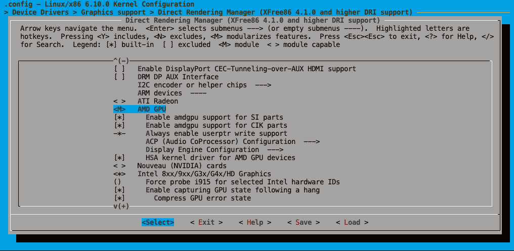
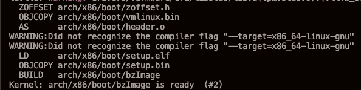
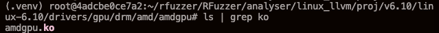
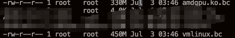

# 使用LLVM编译Linux内核

当我们要对Linux内核进行静态分析，或者进行代码插桩时，使用LLVM编译总是绕不开的一个话题。本教程将会介绍，如何使用LLVM将Linux内核编译成一个`LLVM Bitcode`文件，以及如何使用LLVM对Linux内核代码进行代码插桩

## 将Linux编译为LLVM Bitcode

### 准备环境

该过程需要配置相应的依赖环境，具体来说，需要准备Linux编译环境、LLVM、Python

- Linux
  - 在编译Linux内核时候，必须要安装一些环境，比如flex, bison, openssl等，详见{ref}`Linux 内核的编译与运行 <linux-kernel-compile-run>`
- LLVM
  - 可以选择编译安装，或者从官网[LLVM Releases](https://github.com/llvm/llvm-project/releases)直接下载二进制版本，网上教程很多，在这里就不赘述了
- Python
  - Pyhton需要安装wllvm包
  
### 编译安装

进入到Linux内核源码目录，激活相应的Python虚拟环境，安装好wllvm，配置好需要的llvm环境。执行以下命令，生成配置：

```console
# 生成基础配置
make LLVM=1 defconfig  

# 打开TUI选择配置
make LLVM=1 menuconfig
```

:::{important}
使用wllvm编译过程中会出现大量warning，但是Linux内核编译时默认会将warning当作error处理，导致编译失败
所以我们在menuconfig里，General setup -> 取消勾选"compile the kernel with warnings as errors"，保存、关闭即可。
:::

等待选择好需要的配置之后，就可以执行以下命令开始编译：

```console 
LLVM_COMPILER=clang make CC=wllvm LLVM=1 -j
```

编译完成后，可以在源码根目录下看到`vmlinux`，使用以下命令即可抽取出对应的LLVM Bitcode

```console
extract-bc vmlinux
```

此时目录下会多出一个`vmlinux.bc`

## 将Linux Module编译为LLVM Bitcode

整个Linux内核终究太过庞大，大多数时候，我们可能只是想要抽取出其中的某几个模块进行研究。此时，我们只需要编译看个Kernel Module，生成`.ko`文件后，再提取`.bc`即可。

我们进入到Linux内核源码根目录下，在`menuconfig`中，将你需要的模块配置为`<m>`（以Module形式编译）,然后执行以下命令进行编译：

```console
LLVM_COMPILER=clang make CC=wllvm LLVM=1 -j
```

例如，如果我想要编译一个amdgpu模块，那么我首先将AMDGPU的选项配置为`<m>`



然后执行命令，将其编译为`.ko`

```console
LLVM_COMPILER=clang make CC=wllvm LLVM=1 -j
```



编译完成后，可以在`drivers/gpu/drm/amd/amdgpu`目录下找到一个名为amdgpu.ko的文件



然后我们使用`extract-bc`命令即可抽取出对应的LLVM Bitcode

```
extract-bc amdgpu.ko
```



可以看到，多少还是能够减少一些后续分析的开销的。

## 使用LLVM对Linux进行代码插桩

未完待续... 

## 参考

- https://blog.csdn.net/ckugua/article/details/129502143
- https://blog.csdn.net/weixin_42492218/article/details/129813892