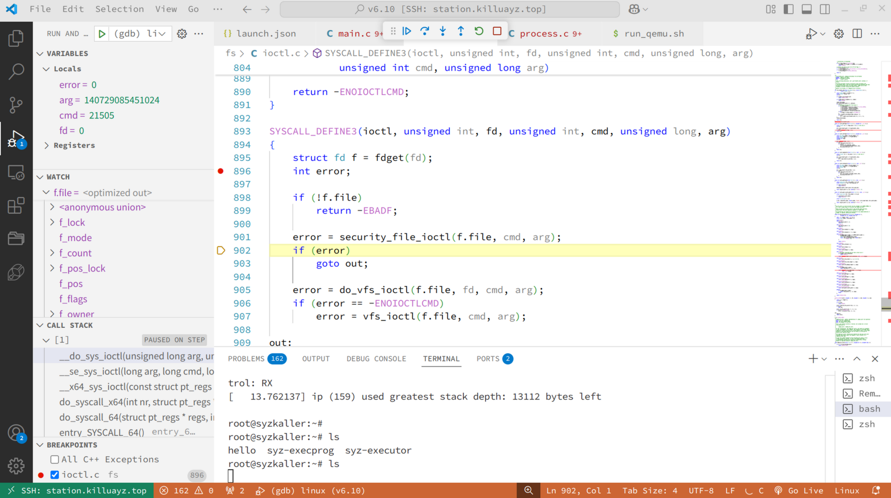

(linux_kernel_debug)=

# Linux内核调试

> 本章内容主要介绍如何使用gdb+qemu进行linux内核的调试
> 参考https://www.cnblogs.com/alantu2018/p/8997149.html

## 内核调试配置选项

内核中已经有了很多用于调试的功能，但是这些功能会带来性能开销，输出很多信息，因此默认是关闭的，如果想要调试内核，我们需要将其打开。

调试Linux内核时，需要开启的编译选项包括但不限于以下几个：

1. **CONFIG_DEBUG_INFO**：这个选项会使得编译出的内核包含全部的调试信息，这对于使用gdb进行调试是非常必要的。

2. **CONFIG_KGDB**：启用这个选项可以在内核配置菜单中启用kgdb支持，kgdb是一个用于内核调试的工具，支持远程调试。

3. **CONFIG_FTRACE**：启用ftrace可以用于函数跟踪，这对于调试内核函数非常有用。

4. **CONFIG_DEBUG_PAGEALLOC**：这个选项用于调试页分配问题，可以发现内存泄漏的错误。

5. **CONFIG_DEBUG_SPINLOCK**：这个选项用于调试自旋锁相关问题，可以发现spinlock未初始化及各种其他的错误。

6. **CONFIG_DEBUG_SPINLOCK_SLEEP**：这个选项用于检查spinlock持有者睡眠的情况，有助于排除死锁引起的错误。

7.  **CONFIG_DEBUG_STACK_USAGE**：这个选项用于跟踪内核栈的溢出错误，有助于发现栈溢出问题。

9.  **CONFIG_DEBUG_DRIVER**：这个选项用于输出驱动核心的调试信息，有助于调试驱动相关的问题。

这些选项可以通过`make menuconfig`命令在内核配置菜单中设置。开启这些选项后，可以编译出包含调试信息的内核，方便后续的调试工作。Linux内核还提供了很多调试选项，大家可以自行去了解。

## 编译

使用make命令编译

```bash
make -j
```


## 开始调试

### 运行QEMU

```bash
qemu-system-x86_64 \
	-m 2G \
	-smp 1 \
	-kernel $KERNEL/arch/x86_64/boot/bzImage \
	-append "console=ttyS0 root=/dev/sdb earlyprintk=serial net.ifnames=0 nokaslr" \
	-drive file=$IMAGE/bullseye.img,format=raw \
	-net user,host=10.0.2.10,hostfwd=tinfo breakpointscp:127.0.0.1:10021-:22 \
	-net nic,model=e1000 \
	-enable-kvm \
	-nographic \
	-pidfile vm.pid \
	-s -S \
	2>&1 | tee vm.log
```

其中，`-smp 1`建议开启，只要不是为了研究SMP并发，就设为1，不然调试难度可能有点大。建议不要加`-enable-kvm`，否则添加断点的时候，就要使用hbreak，不太方便，调试时候对性能也不会有太高的要求。`-append`中是传给kernel的参数，**一定**带上`nokaslr`，关闭内核地址随机化，**否则断点无法触发，也无法进行单步调试**。`-s`是-s shorthand for -gdb tcp::1234，设置gdb调试的默认端口。`-S`是-S freeze CPU at startup (use 'c' to start execution)，表示在入口处停下。


### 命令行使用gdb连接

在启动qemu之后，我们就开启终端执行gdb

```bash
gdb -tui $KERNEL/vmlinux
```

进入到gdb的界面之后，使用下面的命令，就可以调试了

```bash
target remote localhost:1234
```

只用最原版的gdb可能比较麻烦，我们可以添加一个gdb的模组，让gdb更加好用。这里推荐使用[pwndbg](https://pwndbg.re/)，提供了更美观的界面和更丰富直观的提示信息，调试起来更舒服。


### 使用vscode进行调试

配置launch.json如下，启动qemu之后，连接即可。

```json
{
    // 使用 IntelliSense 了解相关属性。 
    // 悬停以查看现有属性的描述。
    // 欲了解更多信息，请访问: https://go.microsoft.com/fwlink/?linkid=830387
    "version": "0.2.0",
    "configurations": [
        {
            "name": "(gdb) linux",
            "type": "cppdbg",
            "request": "launch",
            // "preLaunchTask": "vm", //if you don't want to launch vm via vscode, common this line!
            "program": "${workspaceRoot}/vmlinux",
            "miDebuggerServerAddress": "localhost:1234",
            "args": [],
            "stopAtEntry": true,
            "cwd": "${workspaceFolder}",
            "environment": [],
            "externalConsole": false,
            "MIMode": "gdb",
            "miDebuggerArgs": "-n",
            "targetArchitecture": "x64",
            "hardwareBreakpoints": {
                "require": true
            },
            //"logging": { "engineLogging": true },
            "setupCommands": [
                {
                    "description": "Hardware breakpoint at start",
                    "text": "-break-insert -h -f start_kernel", // specify your entry point label, mine was 'start_kernel'
                    "ignoreFailures": true
                },
                // {
                //     "text": "set arch i386:x86-64:intel",
                //     "ignoreFailures": false
                // },
                // {
                //     "text": "dir .",
                //     "ignoreFailures": false
                // },
                // {
                //     "text": "add-auto-load-safe-path ./",
                //     "ignoreFailures": false
                // },
                {
                    "text": "-enable-pretty-printing",
                    "ignoreFailures": true
                }
            ]
        }
    ]
}
```

最终我们在Vscode中便可以进行调试



## 打印调式信息

### BUG() 和 BUG_ON()

BUG()和BUG_ON()可以方便地标记BUG，他们被定义在`include/asm-generic/bug.h`中。

```cpp
#define BUG() do {		\
	do {} while (1);	\
	unreachable();		\
} while (0)

#define BUG_ON(condition) do { if (unlikely(condition)) BUG(); } while (0)
```

### dump_stack()

有些时候，只需要在终端上打印一下栈的回溯信息来帮助你调试。这时可以使用dump_stack()。这个函数只在终端上打印寄存器上下文和函数的
跟踪栈。

### printk()

#### 简述

内核提供的格式化打印函数，用法和printf()类似，在几乎任何地方，任何时候（中断上下文，进程上下文等）都可以使用，但是在终端初始化的时候是不能调用的。
也可以使用early_printk()，它在系统启动初期就具备打印能力，但只支持部分硬件体系。

#### LOG等级

printk相比printf多了一个指定LOG等级的功能，内核根据这个等级判断是否将它打印在终端上。
内核支持以下几种日志级别。
如果没有提供日志级别，就默认是`KERN_WARNING`。

```cpp
#define KERN_EMERG	KERN_SOH ""	/* system is unusable */
#define KERN_ALERT	KERN_SOH ""	/* action must be taken immediately */
#define KERN_CRIT	KERN_SOH ""	/* critical conditions */
#define KERN_ERR	KERN_SOH ""	/* error conditions */
#define KERN_WARNING	KERN_SOH ""	/* warning conditions */
#define KERN_NOTICE	KERN_SOH ""	/* normal but significant condition */
#define KERN_INFO	KERN_SOH ""	/* informational */
#define KERN_DEBUG	KERN_SOH ""	/* debug-level messages */
#define KERN_DEFAULT	KERN_SOH ""	/* the default kernel loglevel */
```

## 参考的qemu运行脚本

```bash
#!/bin/bash

KERNEL=./arch/x86_64/boot/bzImage
# KERNEL=/new-pool/linux_kernel/kernel/v6.10/arch/x86/boot/bzImage
IMAGE=/new-pool/linux_kernel/Kernel_Fuzzing_Env/kernel/images/buster.img

# 初始化 DEBUG 为 0，表示未启用调试模式
DEBUG=0
DEBUG_FLAGS=""
KVM_FLAGS="-enable-kvm"
# 使用 getopts 处理短选项 -d
while getopts ":d" opt; do
    case $opt in
        d)
            DEBUG=1
            ;;
        \?)
            echo "无效的选项: -$OPTARG"
            exit 1
            ;;
    esac
done

# 根据 DEBUG 的值输出结果
if [ $DEBUG -eq 1 ]; then
    echo "调试模式已启用。"
        DEBUG_FLAGS=" -s -S "
        KVM_FLAGS=""
else
    echo "调试模式未启用。"
fi

sudo qemu-system-x86_64 \
        -m 2G \
        -smp 2 \
        -kernel $KERNEL \
        -append "console=ttyS0 root=/dev/sda earlyprintk=serial net.ifnames=0 nokaslr" \
        -drive file=$IMAGE,format=raw \
        -net user,host=10.0.2.10,hostfwd=tcp:127.0.0.1:10021-:22 \
        -net nic,model=e1000 \
        $KVM_FLAGS \
        -nographic \
        $DEBUG_FLAGS \
        -pidfile vm.pid \
        2>&1 | tee vm.log
```

## 优化调试体验

Kernel 默认使用-O2 编译，这会进行函数内联、循环展开、常量折叠等优化，这会使得调试起来比较困难。
为了方便调试，我们可以使用`-Og` 编译， `-Og`优化选项是专门为调试设计的优化级别，它有以下优点：

- 保留变量和函数信息，便于GDB调试
- 减少代码重排，使执行流程更接近源代码顺序
- 保留未使用的变量和函数参数

一般来说，你需要调试哪个模块，就修改对应模块的 Makefile文件，不然可能会遇到超级多编译问题。以amdgpu模块为例，我们需要做以下两件事情：

- 1. 修改文件`drivers/gpu/drm/amd/amdgpu/Makefile`，在其中添加`subdir-ccflags-y += -Og`
- 2. 通过`make menuconfig`，取消将 warning 作为 error 处理的选项

接下来正常编译就行

