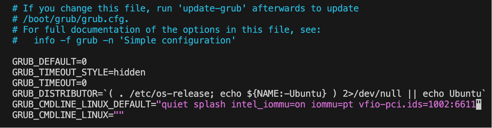

# QEMU 中如何直连设备

在使用 qemu 的时候，我们默认是使用了 qemu 自己写的模拟设备，但qemu 并非万能的，当我们需要在虚拟机中使用某些设备，而 qemu 恰好没有，或者当我们想要使用诸如 gpu 等设备，虽然 qemu 提供了虚拟的 gpu，但是效率肯定不如真正的 gpu，这时应该怎么办呢？

好在 qemu 它提供了 vfio-pci 可以用于直连设备。下面以 amdgpu 为例介绍如何使用 qemu 直连设备

## 系统参数

```
            .-/+oossssoo+/-.               ziyang@ziyang-ThinkStation-P920 
        `:+ssssssssssssssssss+:`           ------------------------------- 
      -+ssssssssssssssssssyyssss+-         OS: Ubuntu 24.04.2 LTS x86_64 
    .ossssssssssssssssssdMMMNysssso.       Host: 30BDA5AHCW ThinkStation P920 
   /ssssssssssshdmmNNmmyNMMMMhssssss/      Kernel: 6.14.0-27-generic 
  +ssssssssshmydMMMMMMMNddddyssssssss+     Uptime: 10 mins 
 /sssssssshNMMMyhhyyyyhmNMMMNhssssssss/    Packages: 2453 (dpkg), 95 (nix-user), 60 (nix-default), 12 (snap) 
.ssssssssdMMMNhsssssssssshNMMMdssssssss.   Shell: zsh 5.9 
+sssshhhyNMMNyssssssssssssyNMMMysssssss+   Resolution: 1920x1080 
ossyNMMMNyMMhsssssssssssssshmmmhssssssso   Terminal: node 
ossyNMMMNyMMhsssssssssssssshmmmhssssssso   CPU: Intel Xeon Silver 4210 (20) @ 3.200GHz 
+sssshhhyNMMNyssssssssssssyNMMMysssssss+   GPU: NVIDIA Quadro P1000 
.ssssssssdMMMNhsssssssssshNMMMdssssssss.   GPU: AMD ATI Radeon HD 8570 / R5 430 / R7 240/340 / Radeon 520 OEM 
 /sssssssshNMMMyhhyyyyhdNMMMNhssssssss/    Memory: 29064MiB / 256351MiB 
  +sssssssssdmydMMMMMMMMddddyssssssss+
   /ssssssssssshdmNNNNmyNMMMMhssssss/                              
    .ossssssssssssssssssdMMMNysssso.                               
      -+sssssssssssssssssyyyssss+-
        `:+ssssssssssssssssss+:`
            .-/+oossssoo+/-.

```

我们将要直连的是AMD ATI Radeon HD 8570

## 第一步：修改 BIOS 启用 VT-d

想要启动设备直连，我们首先需要开启 VT-d(Intel VT for Directed I/O)，这需要我们修改 BIOS 设置，它默认是不开启的，具体怎么进入 BIOS 设置，不同设备不一样，大家可以去搜一搜，我这里就找到对应的选项，选择Enabled即可


## 第二步：检查显卡所在iommmu group

接下来我们需要运行以下脚本，查找显卡所在的iommmu group

```bash
#!/bin/bash
shopt -s nullglob
for g in $(find /sys/kernel/iommu_groups/* -maxdepth 0 -type d | sort -V); do
    echo "IOMMU Group ${g##*/}:"
    for d in $g/devices/*; do
        echo -e "\t$(lspci -nns ${d##*/})"
    done;
done;
```

运行结果如下：

```console
$ ./iommu-group.sh
......

IOMMU Group 5:
        65:00.0 VGA compatible controller [0300]: Advanced Micro Devices, Inc. [AMD/ATI] Oland [Radeon HD 8570 / R5 430 OEM / R7 240/340 / Radeon 520 OEM] [1002:6611] (rev 87)
        65:00.1 Audio device [0403]: Advanced Micro Devices, Inc. [AMD/ATI] Oland/Hainan/Cape Verde/Pitcairn HDMI Audio [Radeon HD 7000 Series] [1002:aab0]

......
```

可以看到我要直连的显卡属于group 5，但还没有结束，此时运行命令`sudo lspci -vvv`得到如下输出，重点关注的是`Kernel driver in use: radeon`，这说明了现在正在使用的驱动程序是radeon，我们的目标是让其使用驱动程序vfio-pci

```
65:00.0 0300: 1002:6611 (rev 87) (prog-if 00 [VGA controller])
        Subsystem: 1028:1002
        Control: I/O+ Mem+ BusMaster+ SpecCycle- MemWINV- VGASnoop- ParErr+ Stepping- SERR+ FastB2B- DisINTx+
        Status: Cap+ 66MHz- UDF- FastB2B- ParErr- DEVSEL=fast >TAbort- <TAbort- <MAbort- >SERR- <PERR- INTx-
        Latency: 0, Cache Line Size: 32 bytes
        Interrupt: pin A routed to IRQ 104
        NUMA node: 0
        IOMMU group: 5
        Region 0: Memory at 4bff0000000 (64-bit, prefetchable) [size=256M]
        Region 2: Memory at e0e00000 (64-bit, non-prefetchable) [size=256K]
        Region 4: I/O ports at b000 [size=256]
        Expansion ROM at e0e40000 [disabled] [size=128K]
--
                        MultHdrRecCap- MultHdrRecEn- TLPPfxPres- HdrLogCap-
                HeaderLog: 00000000 00000000 00000000 00000000
        Capabilities: [200 v1] Physical Resizable BAR
                BAR 0: current size: 256MB, supported: 256MB 512MB 1GB 2GB 4GB
        Capabilities: [270 v1] Secondary PCI Express
                LnkCtl3: LnkEquIntrruptEn- PerformEqu-
                LaneErrStat: 0
        Kernel driver in use: radeon
        Kernel modules: radeon, amdgpu
```

## 第三步：修改 GRUB 配置

我们需要修改文件`/etc/default/grub`，添加内核参数`intel_iommu=on iommu=pt vfio-pci.ids=1002:6611`，这表示给内核模块 vfio-pci 设置参数 ids，从而系统会让vfio-pci来做 amdgpu 的驱动程序。



然后我们重新生成 GRUB 配置文件：

```console
$ sudo grub-mkconfig -o /boot/grub/grub.cfg
Sourcing file `/etc/default/grub'
Generating grub configuration file ...
Found linux image: /boot/vmlinuz-6.14.0-27-generic
Found initrd image: /boot/initrd.img-6.14.0-27-generic
Found linux image: /boot/vmlinuz-6.11.0-29-generic
Found initrd image: /boot/initrd.img-6.11.0-29-generic
Found memtest86+ 64bit EFI image: /boot/memtest86+x64.efi
Warning: os-prober will not be executed to detect other bootable partitions.
Systems on them will not be added to the GRUB boot configuration.
Check GRUB_DISABLE_OS_PROBER documentation entry.
Adding boot menu entry for UEFI Firmware Settings ...
done
```
:::{important}
下面需要重启计算机（物理机）
:::

重启后在终端中输入命令查看 amdgpu 是否成功加载驱动程序`vfio-pci`

```console
$ sudo lspci -nnk -d 1002:6611
65:00.0 VGA compatible controller [0300]: Advanced Micro Devices, Inc. [AMD/ATI] Oland [Radeon HD 8570 / R5 430 OEM / R7 240/340 / Radeon 520 OEM] [1002:6611] (rev 87)
        Subsystem: Dell Radeon R5 430 OEM (2048 MByte) [1028:1002]
        Kernel driver in use: vfio-pci
        Kernel modules: radeon, amdgpu
```

## 第四步：启动 qemu

首先我们需要确定显卡（以及 HDMI 音频）设备的完成 PCI 地址，我这里使用的是 amd 的设备，所以 vendor 为 1002，如果要直连别的设备，需要对应进行修改。

```console
$ lspci -nn | grep -iE "1002"
65:00.0 VGA compatible controller [0300]: Advanced Micro Devices, Inc. [AMD/ATI] Oland [Radeon HD 8570 / R5 430 OEM / R7 240/340 / Radeon 520 OEM] [1002:6611] (rev 87)
65:00.1 Audio device [0403]: Advanced Micro Devices, Inc. [AMD/ATI] Oland/Hainan/Cape Verde/Pitcairn HDMI Audio [Radeon HD 7000 Series] [1002:aab0]
```
可以看到，我们的设备的 PCI 地址是`65:00.0`和`65:00.1`，但是我们只用把`65:00.0`添加到参数中就可以

现在我们配置好直连的 amdgpu 在 qemu 的视角下，就是一个vfio-pci设备，所以我们可以通过以下命令启动：

```console
$ qemu-system-x86_64 \
	-m 2G \
	-smp 2 \
	-kernel $KERNEL/arch/x86_64/boot/bzImage \
	-append "console=ttyS0 root=/dev/sdb earlyprintk=serial net.ifnames=0" \
	-drive file=$IMAGE/bullseye.img,format=raw \
	-net user,host=10.0.2.10,hostfwd=tcp:127.0.0.1:10021-:22 \
	-net nic,model=e1000 \
        -device vfio-pci,host=65:00.0,multifunction=on \
	-enable-kvm \
	-nographic \
	-pidfile vm.pid \
	2>&1 | tee vm.log
```

可以看到我们已经正常加载：


## 可能会遇到的问题

### amdgpu 没有正确使用vfio-pci驱动

在`第三步：修改 GRUB 配置`，之后如果你使用命令`sudo lspci -nnk -d 1002:6611`得到的输出如下：
```console
$ sudo lspci -nnk -d 1002:6611
65:00.0 VGA compatible controller [0300]: Advanced Micro Devices, Inc. [AMD/ATI] Oland [Radeon HD 8570 / R5 430 OEM / R7 240/340 / Radeon 520 OEM] [1002:6611] (rev 87)
        Subsystem: Dell Radeon R5 430 OEM (2048 MByte) [1028:1002]
        Kernel driver in use: radeon
        Kernel modules: radeon, amdgpu
```

这说明我们仍然没有正确加载`vfio-pci`驱动

#### 1.检查驱动`vfio-pci`是否存在

可以通过以下命令查看 vfio-pci 这个内核驱动模块是否存在，如果存在应该会有类似输出，否则需要搜一搜怎么安装这个内核驱动模块

```
$ sudo modinfo vfio-pci
filename:       /lib/modules/6.14.0-27-generic/kernel/drivers/vfio/pci/vfio-pci.ko.zst
description:    VFIO PCI - User Level meta-driver
author:         Alex Williamson <alex.williamson@redhat.com>
license:        GPL v2
srcversion:     2961A59104CE4DB12621164
alias:          vfio_pci:v*d*sv*sd*bc*sc*i*
depends:        vfio-pci-core,vfio
intree:         Y
name:           vfio_pci
retpoline:      Y
vermagic:       6.14.0-27-generic SMP preempt mod_unload modversions 
sig_id:         PKCS#7
signer:         Build time autogenerated kernel key
sig_key:        4F:FC:29:A0:96:06:71:62:F0:17:75:F3:79:BA:85:7C:6E:E3:7A:1C
sig_hashalgo:   sha512
signature:      86:63:6B:01:02:E7:DB:2F:AE:D1:EB:82:48:F4:D7:DD:4F:BD:12:49:
                71:75:41:00:19:2E:A8:3D:5E:AE:26:DA:91:47:32:A6:BF:26:05:71:
                A3:52:67:FE:A9:DE:ED:D6:D3:20:FD:A4:DE:FF:55:AA:50:BE:60:61:
                1D:92:B4:98:5D:F1:72:68:65:F9:91:37:7F:D4:F7:FF:98:50:7E:2C:
                08:34:27:5B:FA:B1:DE:31:12:21:22:D9:29:2C:3B:6C:BC:6A:7E:93:
                1B:55:1D:E2:A0:4E:07:81:5F:77:12:5E:85:D3:43:46:15:81:EC:9A:
                7D:0B:60:70:72:05:5F:88:60:A1:1B:CA:77:49:46:E1:E3:A7:E4:49:
                86:43:68:1D:43:66:83:E3:20:4D:AA:FA:0E:0A:8D:CE:B3:92:F7:E8:
                FB:62:1C:AD:06:35:8C:8E:E7:75:17:7E:16:C1:69:E2:DD:13:A1:DE:
                B7:AD:B2:E1:5F:36:05:73:5C:26:99:05:CD:4E:5C:FF:5C:D6:AC:EC:
                AD:12:04:2B:49:77:EB:D7:FF:98:60:87:5A:7D:A0:7A:CC:44:61:11:
                C8:A2:D9:51:E0:9C:C5:D5:BD:5B:4A:CB:A0:3C:36:15:1F:7D:D9:3C:
                C2:69:53:E6:4C:9C:67:EE:0C:95:0E:94:DB:94:6D:47:2C:21:8C:11:
                70:C9:6D:2D:CD:56:41:40:CF:6B:B5:D2:FE:DB:67:75:E3:C1:FE:9C:
                4E:77:1E:7C:78:1D:5D:80:E4:B9:22:FD:52:68:8F:F4:73:AA:AF:94:
                A3:D2:42:5C:E1:53:FD:74:C4:35:48:DA:3E:B9:FF:09:DF:A4:5F:F4:
                74:47:18:B8:6B:C9:10:61:BB:F2:6E:48:06:E5:F2:F8:AB:06:6B:F5:
                7C:A6:FE:37:A4:6C:7C:C8:3D:68:44:12:88:9F:DD:AC:1D:3C:B2:25:
                E4:85:D9:DC:C0:69:B3:F3:9C:FB:10:2A:06:5E:B7:14:42:D2:23:EC:
                79:90:E7:92:92:BA:C5:11:3F:FA:3E:9E:F3:FB:BE:CC:E2:DB:A9:97:
                1B:DB:B1:33:9A:3B:56:BD:6A:37:C7:BD:14:29:0B:50:13:F0:1C:96:
                21:BA:85:E7:5E:91:F0:78:CE:AD:7C:97:5D:B6:C6:70:E2:2B:40:37:
                93:EC:94:91:27:72:B7:48:95:36:DE:0D:E9:F2:0B:66:72:E3:50:57:
                B6:88:5F:E3:29:12:48:FD:33:26:3C:8E:41:62:1D:DC:C3:97:EE:4A:
                D8:79:2D:C3:EE:C5:55:E7:0E:2A:C2:1C:82:2E:DD:F6:C0:94:16:F2:
                10:F0:A4:28:25:35:0C:4F:3B:E5:9F:6A
parm:           ids:Initial PCI IDs to add to the vfio driver, format is "vendor:device[:subvendor[:subdevice[:class[:class_mask]]]]" and multiple comma separated entries can be specified (string)
parm:           nointxmask:Disable support for PCI 2.3 style INTx masking.  If this resolves problems for specific devices, report lspci -vvvxxx to linux-pci@vger.kernel.org so the device can be fixed automatically via the broken_intx_masking flag. (bool)
parm:           disable_vga:Disable VGA resource access through vfio-pci (bool)
parm:           disable_idle_d3:Disable using the PCI D3 low power state for idle, unused devices (bool)
parm:           enable_sriov:Enable support for SR-IOV configuration.  Enabling SR-IOV on a PF typically requires support of the userspace PF driver, enabling VFs without such support may result in non-functional VFs or PF. (bool)
parm:           disable_denylist:Disable use of device denylist. Disabling the denylist allows binding to devices with known errata that may lead to exploitable stability or security issues when accessed by untrusted users. (bool)
```

#### 2.修改udev配置

接下来需要修改 udev 配置，禁用 radeon 驱动程序，并且指定 amdgpu 的驱动程序是 vfio-pci

具体来说，我们首先要修改文件`/etc/modprobe.d/vfio.conf`（没有的话就创建），在其中写入以下内容：

```
options vfio-pci ids=1002:6611
```

然后修改文件`/etc/modprobe.d/blacklist-radeon.conf`，写入以下内容，防止 radeon 抢占


```
blacklist radeon
```

#### 3.更新 initrd 根文件系统

通过以下命令，我们可以更新根文件系统

```console
sudo update-initramfs -u
```

:::{important}
下面需要重启计算机（物理机）
:::

重启后，执行以下命令应该能够看到输出：

```console
$ sudo lspci -nnk -d 1002:6611
65:00.0 VGA compatible controller [0300]: Advanced Micro Devices, Inc. [AMD/ATI] Oland [Radeon HD 8570 / R5 430 OEM / R7 240/340 / Radeon 520 OEM] [1002:6611] (rev 87)
        Subsystem: Dell Radeon R5 430 OEM (2048 MByte) [1028:1002]
        Kernel driver in use: vfio-pci
        Kernel modules: radeon, amdgpu
```

#### 4.如果 amdgpu 显示无驱动程序，手动加载驱动程序

如果在第 3 步输出结果如下：

```console
$ sudo lspci -nnk -d 1002:6611
65:00.0 VGA compatible controller [0300]: Advanced Micro Devices, Inc. [AMD/ATI] Oland [Radeon HD 8570 / R5 430 OEM / R7 240/340 / Radeon 520 OEM] [1002:6611] (rev 87)
        Subsystem: Dell Radeon R5 430 OEM (2048 MByte) [1028:1002]
        Kernel modules: radeon, amdgpu
```

那么我们需要手动加载驱动程序`vfio-pci`

```console
$ sudo modprobe vfio-pci
$ lsmod | grep vfio
vfio_pci               16384  0
vfio_pci_core          94208  1 vfio_pci
vfio_iommu_type1       49152  0
vfio                   69632  4 vfio_pci_core,vfio_iommu_type1,vfio_pci
iommufd               118784  1 vfio
irqbypass              12288  2 vfio_pci_core,kvm
```

此时重新查看，可以看到 amdgpu 设备被加载了vfio-pci这个驱动程序：

```console
$ sudo lspci -nnk -d 1002:6611
65:00.0 VGA compatible controller [0300]: Advanced Micro Devices, Inc. [AMD/ATI] Oland [Radeon HD 8570 / R5 430 OEM / R7 240/340 / Radeon 520 OEM] [1002:6611] (rev 87)
        Subsystem: Dell Radeon R5 430 OEM (2048 MByte) [1028:1002]
        Kernel driver in use: vfio-pci
        Kernel modules: radeon, amdgpu
```

### group 5 is not viable

```
qemu-system-x86_64: -device vfio-pci,host=65:00.0,multifunction=on: vfio 0000:65:00.0: group 5 is not viable
Please ensure all devices within the iommu_group are bound to their vfio bus driver.
```

在运行 qemu 时，可能会出现这个问题，这个问题本质是因为同一个iommu-group的，要同时，一起直连，不能只直连其中一个

我们重新运行之前的脚本`iommu-group.sh`，得到如下结果：

```
IOMMU Group 5:
        65:00.0 VGA compatible controller [0300]: Advanced Micro Devices, Inc. [AMD/ATI] Oland [Radeon HD 8570 / R5 430 OEM / R7 240/340 / Radeon 520 OEM] [1002:6611] (rev 87)
        65:00.1 Audio device [0403]: Advanced Micro Devices, Inc. [AMD/ATI] Oland/Hainan/Cape Verde/Pitcairn HDMI Audio [Radeon HD 7000 Series] [1002:aab0]
```

可以看到，`[1002:6611]`和`[1002:aab0]`是一组的，都得直连，但是现在其中`[1002:aab0]`设备出问题，没有绑定驱动程序`vfio-pci`

```console
$ lspci -nnk -d 1002:6611
65:00.0 VGA compatible controller [0300]: Advanced Micro Devices, Inc. [AMD/ATI] Oland [Radeon HD 8570 / R5 430 OEM / R7 240/340 / Radeon 520 OEM] [1002:6611] (rev 87)
        Subsystem: Dell Radeon R5 430 OEM (2048 MByte) [1028:1002]
        Kernel driver in use: vfio-pci
        Kernel modules: radeon, amdgpu
$ lspci -nnk -d 1002:aab0
65:00.1 Audio device [0403]: Advanced Micro Devices, Inc. [AMD/ATI] Oland/Hainan/Cape Verde/Pitcairn HDMI Audio [Radeon HD 7000 Series] [1002:aab0]
        Subsystem: Dell Oland/Hainan/Cape Verde/Pitcairn HDMI Audio [Radeon HD 7000 Series] [1028:aab0]
        Kernel driver in use: snd_hda_intel
        Kernel modules: snd_hda_intel
```

我们可以使用之前的方法，通过修改 udev 然后重启实现，也可以使用一个临时的解决方法：

```console
echo "0000:65:00.0" | sudo tee /sys/bus/pci/devices/0000:65:00.0/driver/unbind
echo "1002 6611"    | sudo tee /sys/bus/pci/drivers/vfio-pci/new_id
echo "0000:65:00.1" | sudo tee /sys/bus/pci/devices/0000:65:00.1/driver/unbind
echo "1002 aab0"    | sudo tee /sys/bus/pci/drivers/vfio-pci/new_id
```

通过以上命令，我们可以为这两个设备重新绑定驱动程序，现在重新查看设备对应的驱动程序：

```console
$ lspci -nnk -d 1002:aab0
65:00.1 Audio device [0403]: Advanced Micro Devices, Inc. [AMD/ATI] Oland/Hainan/Cape Verde/Pitcairn HDMI Audio [Radeon HD 7000 Series] [1002:aab0]
        Subsystem: Dell Oland/Hainan/Cape Verde/Pitcairn HDMI Audio [Radeon HD 7000 Series] [1028:aab0]
        Kernel driver in use: vfio-pci
        Kernel modules: snd_hda_intel
$ lspci -nnk -d 1002:6611
65:00.0 VGA compatible controller [0300]: Advanced Micro Devices, Inc. [AMD/ATI] Oland [Radeon HD 8570 / R5 430 OEM / R7 240/340 / Radeon 520 OEM] [1002:6611] (rev 87)
        Subsystem: Dell Radeon R5 430 OEM (2048 MByte) [1028:1002]
        Kernel driver in use: vfio-pci
        Kernel modules: radeon, amdgpu
```

可以看到两个都已经成功绑定到驱动程序`vfio-pci`上了


:::{note}
参考文章
- https://www.cnblogs.com/kuangke/p/15862963.html
- https://nobug.xin/2022/11/27/qemu%E6%98%BE%E5%8D%A1%E7%9B%B4%E9%80%9A%E8%AF%A6%E7%BB%86%E6%95%99%E7%A8%8B/index.html
- https://zhuanlan.zhihu.com/p/715834304
:::

