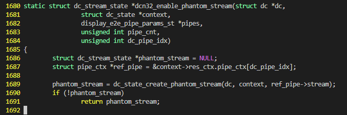
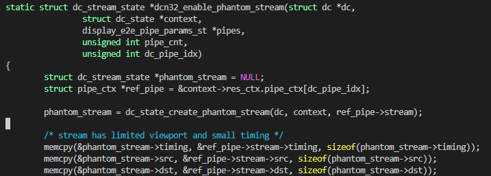

# 如何快速定位内核中Bug或Patch出现的commit


## 问题描述

在内核中，我们经常需要做的一个事情就是，确定某一个bug/patch提交的commit是什么

以amdgpu上的一个bug为例, 我们现在只大概知道补丁的位置，以及修复的内容，那我们如果快速地定位，这两行代码是哪个commit添加进来的呢？

```c
static struct dc_stream_state *dcn32_enable_phantom_stream(struct dc *dc,
		struct dc_state *context,
		display_e2e_pipe_params_st *pipes,
		unsigned int pipe_cnt,
		unsigned int dc_pipe_idx)
{
	struct dc_stream_state *phantom_stream = NULL;
	struct pipe_ctx *ref_pipe = &context->res_ctx.pipe_ctx[dc_pipe_idx];

	phantom_stream = dc_state_create_phantom_stream(dc, context, ref_pipe->stream);
	// 以下对phantom_stream的检查是补丁
    if (!phantom_stream)
		return phantom_stream;

	/* stream has limited viewport and small timing */
	memcpy(&phantom_stream->timing, &ref_pipe->stream->timing, sizeof(phantom_stream->timing));
	memcpy(&phantom_stream->src, &ref_pipe->stream->src, sizeof(phantom_stream->src));
	memcpy(&phantom_stream->dst, &ref_pipe->stream->dst, sizeof(phantom_stream->dst));
	DC_FP_START();
	dcn32_set_phantom_stream_timing(dc, context, ref_pipe, phantom_stream, pipes, pipe_cnt, dc_pipe_idx);
	DC_FP_END();

	dc_state_add_phantom_stream(dc, context, phantom_stream, ref_pipe->stream);
	return phantom_stream;
}
```

## 解决方案

这时候需要用到`git bisect`命令，它使用二分搜索算法来查找提交历史中的哪一次提交引入了错误。它几乎能让你闭着眼睛快速定位任何源码导致的问题，非常实用。

该patch是在`v6.10`-`v6.11`之间添加的，所以我们大概能够定位搜索区间。首先，我们checkout到一个已经修复的commit，这里我们checkout到`v6.11`

```console
$ git checkout v6.11
HEAD 目前位于 98f7e32f20d2 Linux 6.11
```

然后标定二分查找的区间，执行完该命令后，就会马上checkout到中间的一次提交

```console
# git bisect start <最近打了patch的commit> <较远的未打patch的commit>
$ git bisect start v6.11 v6.10
二分查找中：在此之后，还剩 7076 个版本待测试 （大概 13 步）
[b3ce7a30847a54a7f96a35e609303d8afecd460b] Merge tag 'drm-next-2024-07-18' of https://gitlab.freedesktop.org/drm/kernel
```

这时候我们需要查看一下对应的代码是否被打上patch

```console
$ vim drivers/gpu/drm/amd/display/dc/resource/dcn32/dcn32_resource.c 
```



可以看到，当前的文件已经打上了补丁，所以我们将其标定为bad。至于为什么打了patch我们就要标定为bad呢？这里我们就将这个patch考虑成给代码引入了bug，所以标定为bad

```console
$ git bisect bad
二分查找中：在此之后，还剩 3572 个版本待测试 （大概 12 步）
[51835949dda3783d4639cfa74ce13a3c9829de00] Merge tag 'net-next-6.11' of git://git.kernel.org/pub/scm/linux/kernel/git/netdev/net-next
```


再次使用vim查看文件，可以看到，该commit是未打patch的，所以我们标记为good



```console
$ git bisect good
二分查找中：在此之后，还剩 1786 个版本待测试 （大概 11 步）
[20baedb8033d0ba6ae382fc9974b481fdb32e7ef] drm/xe/vf: Skip attempt to start GuC PC if V
```

我们不同地重复以上过程，最终就可以定位到提交这个patch的commit：

```console
$ git bisect good
二分查找中：在此之后，还剩 0 个版本待测试 （大概 1 步）
[470f3760cfe6dd2ce66cf9159e65876f7eb28792] drm/amd/display: Check dc_stream_state before it is used
```

对应的commit message如下：

```
commit 470f3760cfe6dd2ce66cf9159e65876f7eb28792 (HEAD)
Author: Alex Hung <alex.hung@amd.com>
Date:   Mon Jun 3 08:28:47 2024 -0600

    drm/amd/display: Check dc_stream_state before it is used
    
    dc_state_get_stream_status dc_state_get_paired_subvp_stream and other
    functions can return null, and therefore null must be checked before
    status can be used.
    
    This fixes 21 NULL_RETURNS issues reported by Coverity.
    
    Reviewed-by: Harry Wentland <harry.wentland@amd.com>
    Acked-by: Hamza Mahfooz <hamza.mahfooz@amd.com>
    Signed-off-by: Alex Hung <alex.hung@amd.com>
    Signed-off-by: Alex Deucher <alexander.deucher@amd.com>
```

使用命令`git diff HEAD^ HEAD`查看，可以看到，这个commit确实是修改了对应的代码：

```diff
diff --git a/drivers/gpu/drm/amd/display/dc/resource/dcn32/dcn32_resource.c b/drivers/gpu/drm/amd/display/dc/resource/dcn32/dcn32_resource.c
index 2e1b30a33ea9..969658313fd6 100644
--- a/drivers/gpu/drm/amd/display/dc/resource/dcn32/dcn32_resource.c
+++ b/drivers/gpu/drm/amd/display/dc/resource/dcn32/dcn32_resource.c
@@ -1687,6 +1687,8 @@ static struct dc_stream_state *dcn32_enable_phantom_stream(struct dc *dc,
        struct pipe_ctx *ref_pipe = &context->res_ctx.pipe_ctx[dc_pipe_idx];
 
        phantom_stream = dc_state_create_phantom_stream(dc, context, ref_pipe->stream);
+       if (!phantom_stream)
+               return phantom_stream;
 
        /* stream has limited viewport and small timing */
        memcpy(&phantom_stream->timing, &ref_pipe->stream->timing, sizeof(phantom_stream->timing));
```

如果说要检查哪个版本引入的bug也是类似，只不过判定是good还是bad的方式不同。找patch是直接看文件是否有修改，找bug就看当前commit上能不能触发该bug。

:::{note}
参考文章：

- https://zhuanlan.zhihu.com/p/521905865

:::