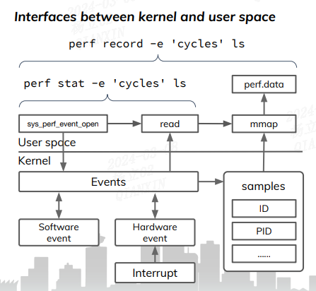

# perf_event_open 函数介绍

> 参考文章： https://blog.csdn.net/weixin_45030965/article/details/128970398

perf_event_open - set up performance monitoring

perf_event_open系统调用从该函数名就可以看出 perf 与 event 联系在一起的。

perf_event_open 对系统中打开的event分配一个对应的perf_event结构，所有对event的操作都是围绕perf_event来展开的。

# 简介

```cpp
#include <linux/perf_event.h>
#include <linux/hw_breakpoint.h>

// Glibc没有为这个系统调用提供包装器；使用syscall调用它：
static long perf_event_open(struct perf_event_attr *hw_event, pid_t pid,
                       int cpu, int group_fd, unsigned long flags)
{
    int ret = syscall(__NR_perf_event_open, hw_event, pid, cpu,
                   group_fd, flags);
    return ret;
}


int perf_event_open(struct perf_event_attr *attr,
                    pid_t pid, int cpu, int group_fd,
                    unsigned long flags);

```


给定一个参数列表，perf_event_open（）返回一个文件描述符fd，用于随后的系统调用（read、mmap、ioctl、prctl、fcntl等），通常用的是对 fd 进行 mmap、ioctl、read操作。

经过perf_event_open()调用以后返回perf_event对应的fd，后续的文件操作对应perf_fops：

```cpp
static const struct file_operations perf_fops = {
	.llseek			= no_llseek,
	.release		= perf_release,
	.read			= perf_read,
	.poll			= perf_poll,
	.unlocked_ioctl		= perf_ioctl,
	.compat_ioctl		= perf_ioctl,
	.mmap			= perf_mmap,
	.fasync			= perf_fasync,
};

```


对perf_event_open（）的调用将创建一个文件描述符，用于测量性能信息。每个文件描述符对应于一个被测量的事件；这些可以组合在一起以同时测量多个事件。

perf_ioctl：事件可以通过两种方式启用和禁用：通过ioctl和prctl。禁用事件时，它不会计数或生成溢出，但会继续存在并保持其计数值。

```cpp
static long perf_ioctl(struct file *file, unsigned int cmd, unsigned long arg)
{
	struct perf_event *event = file->private_data;
	void (*func)(struct perf_event *);
	u32 flags = arg;

	switch (cmd) {
	case PERF_EVENT_IOC_ENABLE:
		func = perf_event_enable;
		break;
	case PERF_EVENT_IOC_DISABLE:
		func = perf_event_disable;
		break;
	......
}

```


事件有两种类型：计数和采样。

perf_read：

计数事件是用于对发生的事件总数进行计数的事件。通常，计数事件结果是通过 read（） 系统调用读取收集的。

通过对计数器执行read()操作，可以获取计数器的当前值，这通常用于读取自由运行计数器（例如，使用perf stat命令）。

perf stat 命令工作在计数模式。

perf_mmap：采样事件定期将测量值写入缓冲区，然后可以通过mmap访问该缓冲区。

采样计数器生成事件并将其存储在环形缓冲区中，用户空间可以通过mmap()来访问该环形缓冲区。可以使用perf record命令将环形缓冲区中的数据保存到名为perf.data的文件中。

perf record 命令工作在采样模式。



计数只是记录了event的发生次数，采样记录了大量信息(比如：IP、ADDR、TID、TIME、CPU、BT)。

Arguments：

struct perf_event_attr *attr是该系统调用最重要的参数，先介绍其他的参数。

pid和cpu参数允许指定要监视的进程和cpu：

```
pid==0，cpu==-1
它测量任何CPU上的调用进程/线程。

pid==0，cpu>=0
这仅在指定CPU上运行时测量调用进程/线程。

pid>0，cpu==-1
它测量任何CPU上指定的进程/线程。

pid>0和cpu>=0
仅当在指定的CPU上运行时，才会测量指定的进程/线程。

pid==-1，cpu>=0
这将测量指定CPU上的所有进程/线程。这需要CAP_SYS_ADMIN功能或/proc/sys/kernel/perf_event_paranoid值小于1。

pid==-1和cpu==-1
此设置无效，将返回错误。

```


group_fd参数允许创建事件组。一个事件组有一个事件，即组长。首先创建组长，group_fd=-1。其余的组成员是通过随后的perf_event_open（）调用创建的，group_fd被设置为组长的文件描述符（group_fd=-1表示单独创建一个事件，并且被认为是只有1个成员的组）。事件组作为一个单元调度到CPU上：只有当组中的所有事件都可以放到CPU上时，它才会放到CPU上。这意味着可以对成员事件的值进行有意义的比较—相加、除法（以获得比率）等等，因为它们已经对同一组执行指令的事件进行了计数。

flags参数是通过对以下零个或多个值进行“或”运算形成的：

```cpp
#define PERF_FLAG_FD_NO_GROUP		(1UL << 0)
#define PERF_FLAG_FD_OUTPUT			(1UL << 1)
#define PERF_FLAG_PID_CGROUP		(1UL << 2) /* pid=cgroup id, per-cpu mode only */
#define PERF_FLAG_FD_CLOEXEC		(1UL << 3) /* O_CLOEXEC */

```


该参数通常为零个值，即flags=0。


devfuzz中，我们使用的PERF_TYPE_PT，指的是perf下的type的值，这需要查看，可能不同的系统是不一样的，在服务器上，type是11

```console
cat /sys/bus/event_source/devices/intel_pt/type
```
