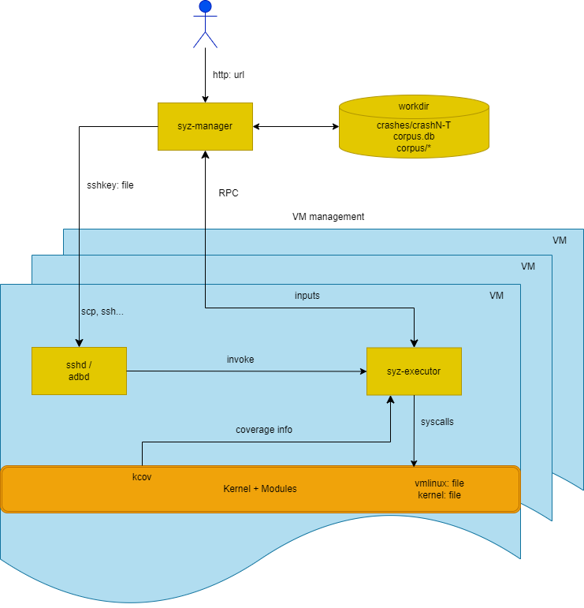

<h1 style="display: flex; justify-content: center; align-items: center; font-size: 30px; font-weight: bold; color: #fff; margin-bottom: 20px;">Syzkaller 介绍</h1>

syzkaller 是一个基于覆盖引导（coverage-guided），能够对内核进行 fuzz 的白盒测试工具。syzkaller 本身支持多种系统调用，但是针对驱动进行 fuzz，主要关注 open、read、write、ioctl、mmap。它支持Akaros, FreeBSD, Fuchsia, gVisor, Linux, NetBSD, OpenBSD, Windows，Darwin等操作系统内核

> 覆盖引导：通过向目标程序插桩，记录程序执行路径和中间执行状态等，将这些信息反馈给fuzzer，然后通过不断修改输入，使得程序执行更多的路径，从而发现潜在的问题


# 运行SyzKaller所需条件

- 内核源码 -> cc编译 -> 内核镜像
- syzkaller源码 -> go编译 -> syzkaller可执行文件
- qemu虚拟机
- 系统调用描述文件（syscall description）
- 配置文件（config file）

# SyzKaller架构及工作流



SyzKaller的工作流程如上图所示。

`syz-manager`：运行在host上 

- 负责调度fuzz任务，包括启动fuzz任务，监控fuzz任务，收集fuzz结果

- 负责fuzz过程：包括输入生成，变异，最小化等

- 持久化存储corpus和crash

`syz-executor`：运行在guest上 

`syz-manager` 会开启 `syz-executor` 进程（每一个VM中开启一个`syz-executor`），它会使用PRC（远过程调用）于`syz-manager`通信，接收来自`syz-manager`的指令，执行fuzz任务，并将结果返回给`syz-manager`。

为了执行程序，`syz-executor`会启动临时子进程。每个临时子进程执行一个输入（一系列系统调用）。它被设计得尽可能简单（为了不干扰模糊测试过程），用c++编写，编译为静态二进制文件，使用共享内存进行通信。

# Syscall Descriptions

`syz-manager` 基于系统调用描述文件（syscall descriptions）生成输入，输入就是一个系统调用序列。系统调用描述文件定义了系统调用的参数类型，参数个数，参数值范围等。

一个系统调用序列长下面这种样子：
```c
open(file filename, flags flags[open_flags], mode flags[open_mode]) fd
read(fd fd, buf buffer[out], count len[buf])
close(fd fd)
open_mode = S_IRUSR, S_IWUSR, S_IXUSR, S_IRGRP, S_IWGRP, S_IXGRP, S_IROTH, S_IWOTH, S_IXOTH
```

描述文件被放到`sys/$OS/*.txt`文件中。`syzkaller`会读取并转化这些描述，然后将它们用于种子的生成，变异，执行，最小化，序列化和反序列化一个程序。一个程序就是一系列的操作系统调用，每一个调用的每一个参数都有具体的值。以下就是一个程序的示例：

```
r0 = open(&(0x7f0000000000)="./file0", 0x3, 0x9)
read(r0, &(0x7f0000000000), 42)
close(r0)
```

在`syzkaller`实际修改程序的时候，它使用的是内存中的类似AST的表达方式，这中表达方式由Call和Arg组成，它们在[prog/prog.go](/fuzzer/syzkaller/src/prog/prog.go)中定义。Call表示一个系统调用，Arg表示一个参数。Call和Arg都有一些字段，它们用于表示参数类型，参数值，参数值范围等。被用于[analyze](/fuzzer/syzkaller/src/prog/analysis.go), [generate](/fuzzer/syzkaller/src/prog/rand.go), [mutate](/fuzzer/syzkaller/src/prog/mutation.go),
[minimize](/fuzzer/syzkaller/src/prog/minimization.go), [validate](/fuzzer/syzkaller/syzkaller/prog/validation.go)等。

这种存储在内存中的结构可以使用代码[transformed](/fuzzer/syzkaller/src/prog/encoding.go)转化成为人类可以阅读的格式，也可以反过来。

除了以上两种格式之外，还有另一个[binary representation](/fuzzer/syzkaller/src/prog/decodeexec.go)， 这是一种更加轻便简洁的格式，它不包含太多的信息，但是它足够用于执行程序，被用于[syz-executor](/fuzzer/syzkaller/src/executor/executor.cc)的实际执行。

